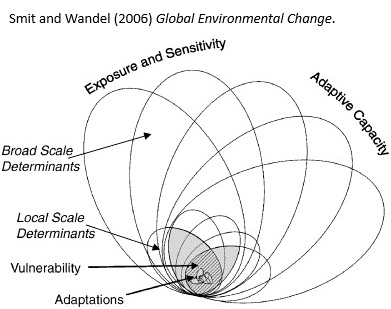
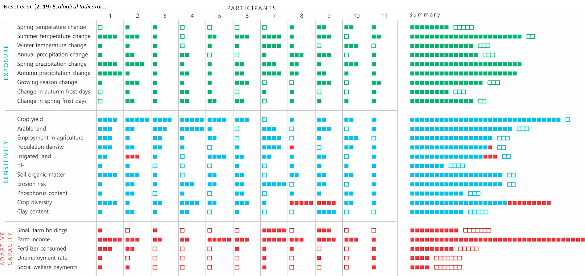

# Research context

## Yield gap

@bommarcoExploitingEcosystemServices2018
- Ecological intensification
  - yield gap = difference between what is actually produced on farms in a region & the potential primary production, given the climatic & edaphic conditions at that location, & with no losses to pests
  - resource use efficiency gap = enhancing output in relation to input
- Pest control objectives
  - to devise locally adapted practices that provide targeted support for beneficial organisms
  - to better understand how natural enemy communities should be composed to deliver stable & sufficient services
- Solutions
  - agricultural landscape diversification
  - targeted diversification:
    - introduce food resources e.g. perennial vegetation
    - push-pull technique: maize intercropped with non-crop plant repellent (e.g. Desmodium) + trap plant attracting pests (e.g. Napier grass) along the border
- Perspectives for agricultural research
  - how species richness, community composition & interactions with communities determine flow & stability of ES & subsequently resource capture by the crop
  - how land use & other environmental factors affect the distribution, abundance & community composition of organisms contributing to crop production
  - how interactions between below and above ground subsidize or counteract primary production & infuence processes at ecosystem level
  - targets for agricultural innovation:
    - minimal environmental impact
    - increased resource use efficiency
    - flexibility & resilience to climate change or pest outbreaks
    - adaptation to local conditions

@vanittersumNarrowingEcologicalYield2025
- "Ecological yield gap"
  - common analytical framework to strengthen collaboration between agronomists & ecologists in assessing the contribution of ES within the wider array of inputs, management practices, technologies & biophysical limits that determine on-farm crop yields
  - definition: yield increase that could be achieved in a given context (climate x soil x cropping system) & at a given input level, by increasing the delivery of ecosystem services via ecological intensification practices which support crop growth & substitute external inputs
- European network: DEPHY in northern France, with Treatment Frequency Index -\> **QUESTION: how integrated will be the indicators for the vulnerability analysis to already existing European framework?**
- Ecological intensification practices:
  - crop rotation
  - intercropping
  - available organic nutrient sources coupled with synthetic nutrients
  - reducing soil tillage intensity
  - prolonging soil cover throughout the year
  - synchronizing resources to the crop's needs via biotic regulation
  - integrating habitat & plant diversity into farmed landscapes to support service provides such as pollinators & predators
- Limitations in the feasibility according to context -\> more attention needed to agronomic functions of ecological intensification practices & context of farm management, climatic conditions & soils
- Yield gap:
  - efficiency: increase in yield that can be achieved, at a given resource supply & in a given context, by using more efficient practices (e.g. precision fertiliser application)
  - resource: yield increase that could be achieved in the given context by providing more resources to the crop
  - technology: not-yet-realised yield difference between the potential yield & the yield achieved by highest yielding farms, hence reflecting the incapacity of current on-farm technologies to reach agronomic best practices (e.g. sub-optimal timing of planting & management, lack of effective pest management practices)
- Ecological yield gap
  - overlap with efficiency, resource & technology
  - e.g. legumes in crop rotation: N provision (resource) + rotation (technology)
- Input x ecological yield gap
  - input-yield production functions: how crop yields respond to an input depending on levels of other growth factors (limiting resources, abiotic & biotic stresses)
- Different mechanisms of ecological intensification impacting yield response curve:
  - increase in intercept (higher yield at zero input level) but same yield plateau: substitutive effect of practice
  - increase in slope, i.e. increase of marginal use efficiency, & higher yield plateau, i.e. shift in maximum yield: complementary effect of practice (e.g. reduced biotic stress)
- Adaptation to context:
  - substitutive practices less effective at high resource input levels but could be useful to increase yields at low input levels
  - complementary practices effective at both low & high input levels
- From field the farm-level
  - upscaling of practices that narrow the ecological yield gap at field level to their assessment at entire crop rotations & farming systems
  - e.g. economic viability of the farm when rotation with less profitable crops involved
  - temporal reliability and cost-effectiveness: profitability only after several years of application, stability under climate and environmental changes
- Research perspectives
    - ecological mechanisms and relationships underlying crop yields:
      - e.g. belowground ES provision, pest suppression by wild predators
      - interactions between crop nutrition & crop protection: resources will be used more efficiently if crop is well protected against weeds, pests & diseases
    - on-station experimental research to investigate single or few ecological intensification practices
      - long-term experiments that can account for variability, evolution & stability of effects
    - on-farm observations
      - benchmarking: to learn from the variation among farms & to identify what farms at the frontier do differently from others
      - measurements: type, timing, method of application...
      - challenge: accounting for many confounding factors & incomplete management information, but can be used to formulate hypotheses to be tested in experimental farms
    - on-farm experimentation
      - limited number of replications for farmer co-management feasibility, but larger number of farms

## Pest control

@agarwalModernTechnologiesPest2021
- Pest control strategies
  - Biological control: suppression of pest populations by natural ennemies (predators, parasites, competitors, diseases)
  - Microbial pesticides: relatively stable formulations of microorganisms that suppress pests by producing poisons, causing diseases, preventing establishment of other microorganisms, or other mechnisms
  - Pest behaviour-modifying chemicals: exploitation of the chemical signals used by living organisms to evoke specific behaviours from other organisms
  - Geneteic manipulation of pest populations: release into the pest population of individuals genetically altered to carry genes that interfere with the pest's reproduction or impact
  - Plant immunization: enhancement of plant resistance to pests by means other than breeding or genetic engineering
- Innovations
  - biorational products: pheromones or living microorganisms with low environmental impact (e.g. to lure pest towards killing agent)
  - insect growth regulators: synthetic insect hormones which prevent from reaching maturity
  - nontoxic heat treatments: kills through dehydration across all life stages
  - CRISPR technology: gene editing tool to regulate fertility & sex determination of insects

@zhouIntegratedPestManagement2024
- Integrated Pest Management: involves integration of multiple control methods, including cultural, biological & chemical, to maintain pest populations below economically damaging levels while minimising risks to the environment & public health
- Fundamental principles:
  - prevention through cultural practices e.g. crop rotation & sanitation
  - monitoring pest populations & their natural enemies
  - using economic thresholds to guide management decisions
  - employing a blend of biological, physical & chemical control methods
  - efficiency assessments
- **Prevention & cultural control methods**
  - *crop rotation*: sequential cultivation of dissimilar crops on a given field across multiple growing seasons
    - aim: spatiotemporal separation of host crops, trap crops & enhanced biodiversity
    - efficiency: crop selection & temporal organisation, crop diversity, length rotation cycle & strategic incorporation of cover crops or green manures
    - side benefits: increase soil fertility
  - *intercropping*: concurrent cultivation of multiple crop species within a single field
    - aim: ecological interactions between diverse plant species to establish agroecosystems limiting pest proliferation while enhancing the activity of natural enemies
    - underlying mechanisms: resource competition, physical barriers, allelopathy & habitat manipulation
    - efficiency: companion crop selection, spatial configuration, timing of establishment
    - side benefits: increase soil fertility, water use efficiency & mitigation risk for crop failure from abiotic stressors
  - *sanitation*: removal & destruction of pest-infested plant material, crop residus & other sources of pest inoculum from farmlands & surrounding areas
    - aim: shrink emergent pest population & prevent spread within & between cropping seasons
    - field-level & farm-level (disinfection equipment, storage & transporation facilities)
  - *resistance varieties*: rely on genetic diversity of crops to minimise adverse-effects of pests & diseases
  - aim: decrease pesticide dependence, minimise yield loss & enhance resilience
  - antixenosis: makes plant less attractive or suitable for feeding, oviposition or shelter
  - antibiosis: plant characteristics with direct adverse consequences on pest growth, development, reproduction or survival (e.g. secondary toxic metabolites, physical barriers)
  - tolerance: capacity of a plant to withstand/recover from pest damage without significant yield reduction
  - potential drawback: resistance development in pest populations
- **Monitoring & decision-making**
  - *scouting & sampling techniques*: monitor pest populations & negative effects on crop plants (visual inspection, sweep nets, sticky traps, pheromones traps, remote sensing technologies)
  - AI technology
    - insect identification based on image recognition & Deep Learning
    - forecasting model based on Machine Learning & neural networks
    - optimising monitoring infrastructure to improve predictive models
  - *economic injury levels* (pest population density at which the cost of crop damage equals the cost of control) & *action thresholds* (lower pest density to prevent populations from reaching EIL)
    - calculations from pest density, crop susceptibility & cost/benefit assessments management strategies
    - required knowledge: accurate monitoring data, pest damage relationships across different environmental conditions & crop phenological stages & propensity for multispecies pest interactions impacting crop yield
- **Biological control**
  - *natural enemies*: parasitoids, predators & pathogens regulating pest populations through predation, parasitism or infection
  - *Classical Biological Control (CBC)*: importation & establishment of natural enemies sourced from the native selection of the target pest
    - aim: long-term pest suppression by reestablishing the ecological balance between the pest & its natural enemy in the introduced range
    - efficiency: host specificity, climatic adaptability, reproductive potential & searching efficiency
    - risks: nontarget impacts on native species, unintended spread of introduced agents to new areas, possible interference with other IPM tactics
  - *Conservation biological control (CVBC)*: modifying the crop environment to favor the survival & performance of natural enemies
    - aim: enhance abundance, diversity & effectiveness of natural enemies in agroecosystems
    - conservation techniques: provision of alternative food resources, creation of shelters & overwintering sites, minimisation of broad-spectrum pesticide applications
    - augmentation techniques: cyclic release of externally grown natural adversaries to supplement existing populations or compensate their absence
  - *gene drives*: introduction of genetic traits limiting the fertility and/or lifespan of targeted pests
- **Chemical control**
  - *selective & targeted pesticide use*
    - required knowledge: pest life cycle, ecological interactions, population fluctuations, crop phenology & relationships within agroecosystems
  - *Resistance Management Strategies (RMS)*: prevent or delay the buildup of pesticide resistance in target pest populations
    - aim: mitigate the selection stress exerted by repeated pesticide applications on pest populations which faour the survival & reproduction of resistance individuals
  - *Biopesticides & naturally derived products*
    - microbial pesticides: bacteria, fungi, viruses & nematodes that are pathogenic to targeted pest species
    - essential oils (atomized powders, nanoemulsions, Natural Deep Eutectic Solvents): repellency, phytotoxicity, entomotoxicity
  - *Nanotechnology*
    - Nanoencapsulation of active ingredient: improve stability, solubility & controlled release
    - Nanoformulations: enhance penetration & translocation of pesticides within plant tissues

## Alternative strategies

### Semiochemical trapping

@raderschallSemiochemicallyAssistedTrap2025
- Aim: to test the efficiency of trap crops coupled with semiochemical trapping for pest management
- Crop: Faba bean
- Pest: broad bean beetle (*Bruchus rufimanus*): feed on pollen & lay eggs on developing pods
- Trap crops:
  - "plant stands that are, per se or via manipulation, deployed to attract, divert, intercept &/or retain targeted insects of the pathogens they vector in order to reduce damage to the main crop"
  - early flowering accessions more damaged: aim for an early flowering cultivar
  - challenge: early attraction but potential dispersal to main crop later on -\> either control agent (kill the pest) or enhanced attractiveness with semiochemicals
- Semiochemicals:
  - signals between individuals of same species (pheromones) or among different species (kairomones) to modify the behaviour of the recipient
  - kairomones in the shape of flower & pod scents attractive for broad bean beetles
- Methods
  - Landscape-scale experiment of 24 commercially grown faba bean fields with 12 pairs of treated & control
  - trap crop: Finnish faba bean cultivar with one-week earlier flowering
  - Capture: pan traps (2021) & white double-sided sticky traps (2023)
  - Measurements: egg number on pod, damage on bean (emergence hole)
- Analysis (lme4)
  - number of eggs per pod among treatment & transect combinations
    - response: number of eggs per pod
    - model: linear mixed effect model based on negative binomial distribution with a log link
    - random effect: transect nested & field pair ID (1\|Field_ID/treatment/transect)
  - proportion of damaged beans among treatment & transect combinations
    - response: total number of beans & number damaged beans per transect
    - model: generalised linear mixed effect model based on binomial distribution with a logit link
    - random effect: treatment nested within field pair ID (1\|Field_ID/treatment)
  - crop yield
    - response: bean weight per square meter
    - model: linear mixed effects model based on nomral distribution
    - random effect: 1\|Field_ID/treatment
  - number of plants/m2 & yield components among transect & treatment combinations
    - response: plants/m2 & pods per plant
    - model: generalised linear mixed effect model based on negative binomial distribution & a log link
    - random effect: 1\|Field_ID/treatment/transect
    - response: average number beans/pod & individual bean weight
    - model: linear mixed effects models based on normal distribution
    - random effect: 1\|Field_ID/treatment
  - assumptions: DHARMa package (distribution residuals, heteroscedasticity)
  - marginal & conditional R^2^: r2_nakagawa from *performance* package
  - interactions treatment x transect: post-hoc tests with *emmeans* package
- Findings: significant but modest reductions of bean damages -\> proof-of-concept but further questions for coast-benefit ratio

### Flower strips

@rodriguez-gasolPerennialFlowerStrips2026
- Aim: to assess the multifunctional effect of flower strip & their spillover to adjacent crops
  - pollinator abundance within field margins
  - natural enemy & herbivore abundance within field margins & spillover into adjacent cereal fields
  - biological pest control in adjacent fields
  - soil detritivore activity within field margins & in adjacent fields
- HYP
  - perennial flower strips enhance abundance of pollinators, natural enemies, herbivores & soil detritivore activity within margins
  - but these groups will not spillover
  - leading to lack of benefits for pest control or soil detritivore activity in adjacent crops
- Study design
  - "Sweden Blossom" initiative: https://hushallningssallskapet.se/vara-projekt-och-uppdrag/hela-sverige-blommar/
  - 10 pairs of sown perennial flower strips & spontaneous vegetation controls (same field except one case)
  - pollinators: flower visitors
  - natural enemies & pests:
    - yellow sticky traps for leaf-dwelling natural enemies & herbivores
    - pitfall traps for ground-dwelling natural enemies
  - arthropod community on crop tiller (count)
  - pest control: aphid predation rates with sentinel prey cards
  - decomposition rate: bait lamina strips
- Analyses
  - Data aggregation
    - plants: average
    - arthropods: sum
    - rates: proportions based on aggregated totals
  - GLMM Field margin x pollinator abundance
    - fixed effects: field margin habitat type
    - random intercept: field
    - response variables: % vegetation cover, total floral area, abundance hoverflies, honey bees, bumblebees & solitary bees
  - GLMM Field margin & adjacent crop x arthropod abundance & decomposition rate
    - fixed effects: field margin habitat type & crop type + two & three-way interactions
    - random intercept: field
    - response variables: abundance leaf-dwelling spiders, predatory beetles, predatory bugs, lacewings, predatory thrips, hoverflies, parasitic wasps, aphids, thrips, other herbivores, ground-dwelling spiders, carabid beetles, rove beetles & decomposition rate
  - GLMM field margin x arthropod tiller count & aphid predation
    - fixed effects: field margin habitat type, crop type & interaction
    - random intercept: field
    - response variables: natural enemies, aphids, thrips & aphid predation rates by leaf-dwelling & ground-dwelling arthropods
  - Distribution: negative binomial & beta-binomial distribution
  - Transformation: shrink transformation for variables bound between 0 & 1
  - Model validation: distribution appropriateness, overdispersion, underdispersion & zero inflation
  - Statistical significance: type III Wald chi2 test with ANOVA function from the *car* package
  - Post-hoc tests to evaluate significant interactions between fixed effects with pairiwse comparisons adjusted for multiple testing using Tukey's method
- Findings
  - Ha validated: perennial flower strips enhanced pollinator abundance & natural ennemies
  - Hb contradicted: spillover of most natural enemy groups in adjacent crop fields
  - hc validated: but no increased pest control, & indesirable tradeoff as herbivorous thrips were 1.37 times more abundant on crop tillers near flower strips

# WP1 - Vulnerability analysis

## Vulnerability concept

@smitAdaptationAdaptiveCapacity2006
- AIM: review the concept of adaptation of human communities to global change in the context of adaptive capacity and vulnerability
- Adaptation (in the context of human dimensions of global change) = process, action or outcome in a system to better cope with, manage or adjust to some changing condition, stress, hazard, risk, or opportunity.
- Pressure & Release model (PAR): identify environmental stresses of hazards & the progression  of social forces that contribute to vulnerability, including those that relate to adaptive capacity.
- Climate research: four common purposes
  - to assess the degree to which they can moderate or reduce negative impacts of climate change, or realise positive effects, to avoid danger
    - adaptations conventionally assumed or hypothetical
    - focus on the effect of assumed adaptations: estimate climate impact & the difference adaptation could make
    - does not
      - empirically investigate adaptations
      - examine actual processes of adaptation or adaptive capacity 
      - explore conditions facilitating or constraining adaptations
      - document decision-making processes
  - to investigate specific adaptation measures for a particular system to assess their relative utility & identify the best options
    - adaptations considered distinct & discrete
    - merit: benefit-cost, cost effectiveness & multiple-criteria procedures
    - does not (generally)
      - investigate processes through which adaptation measures are undertaken
  - to explore the relative adaptive capacity or vulnerability of communities
    - comparative evaluation based on criteria, indices & variables selected by researcher
    - vulnerability: "starting point" assumed to be measurable based on determinants selected *a priori*
    - surrogate measures of exposure or sensitivity & elements of adaptive capacity are estimated & aggregated to generate an overall vulnerability score
    - does not
      - identify processes, determinants or drivers of adaptive capacity & vulnerability as they function in each system
      - address policy & decision-making processes that deal with the conditions that can alter adaptive capacity & vulnerability -> implication implicit from outputs
  - to contribute to practical adaptation initiatives = to investigate the adaptive capacity & adaptive needs in a particular community to identify means of implementing adaptation initiatives or enhancing adaptive capacity
    - identification & development of particular adaptive measures tailored to the needs of that community
    - focus on documenting the way in which the system experiences changing conditions & the processes of decision-making that may accommodate adaptations
    - bottom-up approach, not designed to be aggregated at broader scale
- Vulnerability: a function of the exposure & sensitivity of a system to hazardous conditions & the ability/capacity/resilience of the system to cope, adapt, or recover from the effects of those conditions
  - broader stresses determine exposure & sensitivity through interaction environmental & social forces, & shape adaptive capacity through various social, cultural, political & economic forces, at local level
  - finer scale interaction: local vulnerability
  - adaptations: particularly expressions of inherent adaptive capacity
- Exposure & sensitivity: likelihood of a system experiencing particular conditions, & the occupance & livelihood of the system which influence its sensitivity to such exposure
  - occupance: broader social, economic, cultural, political & environmental conditions driving/determining exposure & sensitivity
  - many determinants of occupance or sensitivity similar to those that influence a system's adaptive capacity
- Adaptive capacity: defined by the conditions that a system can deal with, accommodate, adapt to, and recover from
  - relates to adaptability, coping ability, management capacity, stability, robustness, flexibility & resilience concepts
  - drivers adaptive capacity: forces that influence the ability of a system to adapt
  - local adaptive capacity function of broader conditions, can be influenced by: managerial ability, access to financial, technological & information resources, infrastructure, institutional environment within which adaptations occur, political influence, kinship networks...
  - context-specific in terms of value & nature
  - thresholds, coping ranges: flexible, respond to changes in economic, social, political & institutional conditions over time
  - limited predictability: warm, wet years increase crop production, but can also favour pest outbreaks -> hard to predict overall effect on yield
- Adaptations: manifestations of adaptive capacity, to better deal with problematic exposures and sensitivities
- General principles for practice
  - for the researcher not to presume to know the exposure & sensitivities that are pertinent to the community
  - for the research not to specify a priori determinants of adaptive capacity in the community
  - participatory assessments 
    - allow for the recognition of multiple stimuli beyond those related to climate, including political, cultural, economic, institutional & technological forces
    - recognise interaction of various exposures, sensitivities & adaptive capacities over time (not linear, what is vulnerable for x period is not for y)
    - recognise that sources of exposures, sensitivities & adaptive capacities function across scales, from individual to national
  

@gallopinLinkagesVulnerabilityResilience2006
- AIM: systemic perspective to identify & analyse the conceptual relations among vulnerability, resilience & adaptive capacity within social-ecological systems
- Vulnerability: most often conceptualised as being constituted by components that include exposure to perturbations or external stresses, sensitivity to perturbation, and the capacity to adapt [@adgerVulnerability2006]
  - multiscale nature of the perturbations & their effects upon the system
  - most SES exposed to multiple, interacting perturbations
- Perturbation, stress, hasard, or shock
  - perturbations: major spikes in pressure beyond the normal range of variability in which the system operates, & commonly originate beyond the system or location in question
  - stress: continuous or slowly increasing pressure, commonly within the range of normal variability
- Sensitivity: degree to which the system is modified or affected by an internal or external disturbance or set of disturbances
  - "extent to which a human or natural system can absorb impacts without suffering long-term harm or other significant state change" [@adgerVulnerability2006]
  - exposure-sensitivity represents a unified concept for some authors
- Capacity of response: system's ability to adjust to a disturbance, moderate potential damage, take advantage of opportunities, & cope with the consequences of a transformation that occurs
  - also coping capacity or adaptive capacity
- Exposure: degree, duration and/or extent in which the system is in contact with, or subject to, the perturbation
  - whether to include exposure as a component of vulnerability or not
    - if included, vulnerability becomes a property of the relationship between the system and the perturbation, rather than of the system itself
    - if excluded, vulnerability is a property of the system only, expressing itself when the system is exposed to the perturbation
- Resilience
  - basin of attraction: portion of the state space of a dynamic system that contains one attractor toward which the state of the system tends to go, and is therefore one region of the state space where the system would tend to remain in the absence of strong perturbations
  - attractor: what the behavior of a system settles down to
  - stability landscape: configuration of all basins of attraction, including the boundaries separating them
  - when multiple attractors: a continuous variation in some critical parameter can result in discontinuous changes in the stability landscape of the system -> bifurcations (mathematical theory dynamical systems) or catastrophes (catastrophe theory)
  - three levels of stability
    - local stability or engineering resilience: behaviour of trajectories of the system in the neighbourhood of an attractor, within a given domain of attraction
    - ecological resilience: capacity of the system to remain within the same domain of attraction (assess changes between domains of attraction within the stability landscape of the system)
    - structural stability: capacity of a system to preserve the topology of its trajectories under perturbations of the dynamic equations of the system ("true" transformation of a system)
- Adaptive capacity: ability of a system to adjust to climate change to moderate potential damages, to take advantage of opportunities, or to cope with the consequences (IPCC)
  - two components for SES
    - capacity to cope with environmental contingencies
    - capacity to improve its condition in relation to its environment (often left behind by more recent use of the term adaptive capacity - e.g. IPCC definition too restrictive)

@hinkelIndicatorsVulnerabilityAdaptive2011

## Methodological approach

@Agrowise
- INRAE PROJECT: Guidelines for farm-specific or crop-specific rules for mitigating pesticides impacts while ensuring sustainable agriculture.

@mathisComparisonExemplaryCrop2022
- AIM: multi-criteria analysis to investigate trade-offs in different apple production systems in Switzerland
- Crop protection strategies
  - PEP2018 Swiss: Proof of Ecological Performance of 2018
  - PPP reduced: principles of integrated production system aiming at minimising PPP & residues without causing yield loss
  - High yield: conventional system, yield maximisation, risk minimisation
  - Organic: prohibition synthetic PPPs & mineral fertilisers
- Indicators
  - PPP use: Treatment Frequency Index summarising number of product applications & dosage applied
  - local ecotoxicological risk: model SYNOPS to assess local ecotoxicological risk of PPP on organisms living in edge-of-field surface waters, agricultural soils & terrestrial off-crop habitat
  - global environmental impacts: 
    - Swiss Agricultural Life Cycle Assessment method SALCA
    - freshwater ecotoxicity, eutrophication potential, resource use, global warming potential & biodiversity
  - economic impacts
    - profitability: farmer's hourly wage
    - production risks: yield fluctuations
    - financial autonomy: invested capital
    - workload: labour input

@lechenetReconcilingPesticideReduction2014
- AIM: to assess the sustainability of 48 arable cropping systems from two major agricultural regions of France (conventional, integrated & organic systems) based on a set of economic, environmental & social indicators
- Cropping system classification
  - organic
  - integrated: diversified crop rotations or at least including one non-chemical pest control approach
  - conventional: neither organic nor integrated
- Local reference definition: to reflect the most widespread crop rotation & associated technical management as well as typical agricultural performance in the production situation -> to distinguish effects of agronomic strategies from the effects of the production situation
- Indicators
  - Treatment Frequency Index: summarises level of dependence on pesticides
  - productivity: amount of energy harvested yearly
    - allow comparison of different crop rotations with range of yielding potentials & different energy content
    - transformation crop yield into energy value: Lower Heating Value = amount of energy released per unit of mass by the combustion of the harvested biomass
  - energy consumption: conversion of inputs into energy
    - Dia'terre database: evaluate a carbon-energy balance at farm-scale
    - e.g. calculation energy cost associated with the production of nitrogen fertilisers integrates the energy necessary from raw material production, through materials processing, manufacture & distribution
  - energy efficiency: ratio between productivity & energy consumption
  - economic productivity:
    - gross product: conversion crop yield into economic value
    - semi-net margin: gross product/ha minus input costs = profitability without incentives/subsidies
    - sensitivity to price volatility: relative deviation of semi-net margin over ten contrasting real price scenarios between 2000 & 2010
  - fuel consumption & workload
  - environmental impact: cumulated I-Pest = measures risk for air, surface water & groundwater
  - crop sequence indicator Isc: quantify agronomic effects of crop diversification
  
@martinIntegratedMethodAnalyze2017
- Vulnerability: function of exposure & sensitivity of a system to a range of hazards & the adaptive capacity of the system to cope with, adapt to, or recover from the effects of these conditions
  - exposure: duration, extent & frequency of perturbations
  - sensitivity: degree to which system responds to perturbations
  - exposure & sensitivity determine the potential impact given perturbation variability
  - adaptive capacity: degree to which system can adjust to, moderate, or offset the potential impacts, or take advantage of opportunities created by given events
  - actual impact: impact that remains after accounting for adaptive capacity
- Model-based studies (*ex ante*):
  - enable strict application of the vulnerability framework by isolating farm sensitivity from adaptive capacity
  - drawbacks:
    - limited ability to reproduce farm management & production when applied to new sites
    - simulation of farm adaptations in simplified context ignoring key issues to farmer
- Field-based studies (*ex post*):
  - consider multifactorial context farmers encounter
  - drawbacks:
    - vulnerability cannot be broken down into exposure, sensitivity & adaptive capacity
    - sensitivity not measurable since farmers often react to adverse events by implementing adaptations
- Methodology objectives
  - assessing farm vulnerability to the drivers of multiple contextual changes
  - explaining this vulnerability as a function of initial farm configurations & farmers' multiple technical adaptations
- Main principle: farm vulnerability as a function of three main components of linear regression over time
  - mean level: raw measurements of vulnerability variables (or fitted/mean values)
    - high measurement values =\> towards "good" mean performance
  - general trend over the period: slope of the linear regression of these measurements over time
    - stable or increasing trend =\> towards improvement
  - variability: residuals of the linear regression
    - low =\> towards stability & robustness
- Step 1: choosing vulnerability & explanatory variables (expert knowledge)
  - productivity (e.g. kg protein/ha/year) & economic efficiency (e.g. %/year)
- Step 2: calculating farm-specific vulnerability variables
  - regression for each vulnerability variable as a function of the year to extract trend & residuals
  - performed for all farms, surveyed farms being as random sample from entire farm population
  - linear mixed models with random-coefficient regression
    - overall mean = intercept common to all farms
    - overall trend = slope common to all farms
    - random deviation from the overall mean for each farm
    - random deviation from the overall trend for each farm
    - residuals provide additional measures of stability
    - random rather than fixed effect: extreme values lessened in a random model, which avoids over-emphasizing outliers
  - each farm is characterised by
    - its level at the beginning of the period expressed (intercept), as a deviation from the overall performance level of all farms
    - its trend over the period, as a deviation from the overall trend
    - the variability around the expected trajectory
- Step 3: characterising the diversity of farm vulnerability patterns
  - descriptive analysis: PCA of all vulnerability variables
  - identify relationships among vulnerability variables (+/- correlations)
  - identify patterns of farms' vulnerability trajectories
- Step 4: understanding farm vulnerability from explanatory variables
  - partial least squares regression: to reduce dimensionality & search for the maximum covariance between response & explanatory variables
  - PLS predicts multiple vulnerability variable from two types of explanatory variables (climatic and economic exposure variables) & variables describing initial farm configurations & farmers' technical adaptations over time
- Explanatory variables
  - exposure - related to natural & economic threats
  - adaptive capacity - related to management
  
@fouilletDiversityPesticideUse2023
- Change intensity in pesticide use: Efficiency, Substitution and Redesign framework (ESR)
  - efficiency (e.g. dose reduction) & substitution (e.g. biocontrol) associated with progressive transition
  - redesign (e.g. conversion to organic farming) associated with abrupt & direct transition
- Transition path:
  - succession of linear periods, which determine the possibility of a system to go in one direction but being interrupted by a nodal point
  - can be characterised by the initial point, the effect of the transition (direction & intensity) & the trajectory
- Farm typology
  - simplify & group a variety of farm cases into fewer types to better understand this diversity
  - used to assess & explain the differences between farming systems undergoing changes
- Methodology
  - Treatment Frequency Index (TFI) = sum, for each pesticide product applied during the crop season, of the ratio between the applied dose & the full registered & recommended dose
  - Indicators to build the typology according to farm performances
    - initial normalised TFI (starting point)
      - ratio between initial individual TFI & regional TII
      - normalised to eliminate region effect
      - reflects the intensity of pesticide reduction compared to other farms in the same region
    - final TFI (ending point)
      - mean TFI for the last 3 years (to limit year effect)
      - un-normalised value
    - regression slope (general trend)
      - path taken over 10 years
    - sum of square deviation (overall variability farming system)
    - maximum variation (robustness & variability)
      - maximum residuals having the largest absolute value
    - slope break (ruptures)
      - two-piecewise continuous linear regressions: assume the existence of a breakpoint at the junction of two-line segments
  - Explanatory indicators describing phytosanitary strategies
    - type of product: biocontrol (macroorganisms, microorganisms, chemical mediators, natural substances), copper products
    - applied dose per treatment (fungicides, herbicides, insecticides)
    - use of chemical herbicides
    - production mode (conventional, organic, in conversion)
  - Statistical analysis
    - typology:
      - PCA: identify relationships between indicators
      - hierarchical cluster analysis on coordinates of PCA axes with eigenvalue\>1: define farm trajectory typology
    - characterisation of clusters of pesticides use trajectory
      - ANOVA/non parametric KW: compare indicators used to set up typology between clusters
      - Pearson chi2 (proportions)/t-test (numeric): comparison initial and final point between & within clusters to assess changes in the phytosanitary strategy indicators

@zaatraAssessmentFarmVulnerability2025
- AIM: to provide a multi-criteria assessment of farm vulnerability to climate change in the Pays Haut Languedoc et Vignoble region
- Aspects of vulnerability:
  - exposure: susceptible hazards that can cause damage to people, species or ecosystems, resources or environmental services, infrastructure or economies, or social or cultural goods
  - sensitivity: intrinsic characteristics making it particularly vulnerable/resistant to hazards, resulting in a propensity to be affected (+/-) by a hazard
  - adaptive capacity: system's capacity to evolve to better manage its exposure and/or sensitivity, usually characterised by a set of factors that determines the ability of a system to generate & implement adaptation measures
- Vulnerability factors to climate change
  - physical factors that describe the exposure of vulnerable elements
  - economic factors that describe the economic resources of indviduals, population groups & communities
  - social factors that determine the wellness of individuals, population groups & communities
  - environmental factors
- Methodological approach
  - to combine quantitative & qualitative dimensions in a detailed & multi-criteria farm-scale assessment to integrate farmers' risk perception
  - agricultural vulnerability index (several formulas, no consensus)
    - positive function of potential impact (exposure and sensitivity index)
    - negative function of adaptive capacity
    - Farm Vulnerability Index = (Exposure*Sensitivity/Adaptive capacity)
  - variable transformation
    - normalisation quantitative variables with min-max method
    - normalisation qualitative variables with categorical scale's method
    - farmer rating on how each variable affects their farm's vulnerability from 0 to 10
  - linear model to analyse interactions between variables in each vulnerability component
    - calculated vulnerability: average variables with all same weight
    - declared vulnerability: different weights according to farmers scores
- Data collection
  - scoping interviews with local stakeholders (2 months) - preliminary
  - expert consultations: semi-directive interviews to evaluate vulnerability approach, selected variables, relevance & feasibility
  - farmer questionnaire: face-to-face with 90 farmers representative of production systems (2h)
    - sociological farmer data
    - farm data (land use type, soil type...)
    - farming practices (weeding, fertilisation, irrigation...)
    - perceptions of climate change
    - ranking vulnerability factors
  - farm exposure to climate change (drought, floods...)
  - farm sensitivity to climate change (soil type, crop diversity)
  - farm adaptive capacity to climate change: human, technical & economic capital
- Analysis
  - descriptive statistics - min, median, mean, max
  - 3 vulnerability groups (low, medium, high) with minimum variance in each category
  - Discriminant Analysis (DA) to investigate relationships between groups & explanatory variables
    - minimises number of important indicators & highlights most relevant elements among a large number of associated sub-components within a collection of uncorrelated variables

### AgroExplore

@wirehnAssessingAgriculturalVulnerability2017
- AIM: to design a conceptual framework to support the integration of geographic visualisation for vulnerability assessments for the development of AgroExplore, an interactive tool for assessing agricultural vulnerability to climate change in Sweden
- Conceptual design
  - issue with vulnerability assessment: different conceptual approaches, different interpretations of the exposure, sensitivity & adaptive capacity composite leading to different methods of calculation
  - approach: addressing inconsistencies by advanced transparency -> flexibility of geovisualization tools
- AgroExplore workflow
  - selection & weighing of agricultural vulnerability indicators
    - selection & categorisation indicators for exposure, sensitivity & adaptive capacity sub-indices
    - indicator weighing
    - geographical exploration of sub-indices through 3 map displays
  - setting of agricultural vulnerability sub-indices
    - selection sub-indices' shares in the integrated index of vulnerability
    - geographical exploration of index through map display
  - exploration of the integrated index with Sankey diagram, parallel coordinate plot, datagrid
- Indicators & data
  - initial set of indicators from literature, which aim to be continuously updated
  - upscaling (aggregation) & downscaling (replication) at municipality level
  - data normalsiation between 0 and 100 using min-max method
- User possibilities
  - default setting: expert knowledge (e.g. default share exposure 40%, sensitivity 30%, adaptive capacity 30%)
  - can adjust indicator weights & sub-indice shares -> update Sankey diagram

@nesetEvaluationIndicatorsAgricultural2019
- AIM: to analyse the role of indicators in assessing agricultural vulnerability to climate change
- Different categories vulnerability assessments
  - regional comparison
  - general assessment of future stressors
  - enhancing the understanding of vulnerability factors as a foundation to design adaptation strategies
- Method
  - 3 focus group sessions in the Norrköping Decision Arena 
  - 3-5 experts/session representing the Swedish Board of Agriculture, the county board, branch organisations & private consultancies in the Östergötland county
  - qualitative data: 2h records of focus session, analysed using thematic analysis
  - quantitative data: the final individual AgroExplore settings
- Assessment of vulnerability indicators & thresholds
  - indicators always selected: spring & autumn precipitation change (exposure), farm income (adaptive capacity)
  - deselection: rather lack of knowledge than considering indicator irrelevant
  - discussion associated with exposure:
    - would a single climatic factor substantially affect exposure, or does it relate more to a combination of factors ?
    - climate change overall considered more important in terms of extremes rather than averages
    - several indicators weighed differently according to crop type considered in the response
    - climate impacts dependent on specific circumstances of the system in which they occur
  - discussion associated with sensitivity:
    - relevance of clay content, P content & pH at aggregated municipality level ?
    - crop yield as the highest-weighted indicator
    - two perspectives for arable land: more is more to lose vs more is higher dispersal of risks
  - discussion associated with adaptive capacity
    - farm income: profitability more important than income to determine adaptive capacity
- Context-dependent correlation of indicators with vulnerability
  - increased winter temperature: increases vulnerability by decreasing ground frost & winter rest, but decreases vulnerability by increasing growing season
  - depends on timing (e.g. precipitation)
  - summer temperature & precipitation: narrow margin of error in determining what magnitude of increase might positively affect productivity
- Missing indicators
  - exposure
    - extreme weather events, variability
    - rain intensity more relevant than summer precipitation
    - ground water content
    - wind: relevant to the efficiency of pesticide application
    - how "increased pests & weeds" variable could be included
    - market: food prices, imports, exports
  - sensitivity
    - slope: estimate need for drainage
    - irregularity field shape
    - market: external prices, profitability
  - adaptive capacity
    - access to pesticides
    - diversity of the farm enterprise
    - access to agricultural extension
    - economic support (subsidies)
    - how to integrate polical decisions/practices

## Swedish data

@StatistikmyndighetenSCB
- Näringsverksamhet och utrikeshandel (Tillväxtanalys)
  - Företagens (business) demografi
    - Konkurser: trends in number of bankruptcies
    - Nystartade företag: emergence of businesses with new operations
    - Uppföljning av nystartade företag: survival rate of start-ups three years after establishment
  - Företagens produktion, försäljning (sales) och ekonomi (yearly)
    - Företagens ekonomi: number companies & employees, production & value added, investments, revenue & cost, operating profit
    - Industrins varuproduktion: industrial production by amount and value
    - Livesmedelsförsäljning fördelad på varugrupper: total volume of food & drink sold in the retail sector
  - Företagsdatabasen (FDB): business registry
- Priser och ekonomiska tendenser (konj.se)
  - Konjunkturbarometern (barometre) företag: economic trends amongst companies in Sweden
  - Byggkostnadsindex (Construction Cost Index): changes in the cost of production factors in residential construction (agricultural buildings included)
  - Byggnadsprisindedx (Construction Price Index): price trends for newly built dwellings
  - Konsumentprisindex: average price trend for total private domestic consumption
  - Prisindex i producent- och importled (PPI): average price trend at the producer & import stages
- Jordbruk, skogsbruk och fiske (Jordbruksverket.se)
  - Jordbrukets ekonomi
    - Ekonomisk kalkyl fö jordbruksseektorn (EAA): value of production in the agricultural sector, production costs & economic development
    - Jordbrukarhushållens inkomster: incomes of farming households
    - Jordbruksekonomiska undersökningen: income, costs & profits for agricultural holdings
  - Jordbrukets produktion
    - Allmän jordbruksstatistik: general agricultural statistics
    - Lagerhållning av spannmål och raps: stocks of cereals & winter rapeseed
    - Livsmedelsstatistik: food consumption
    - Normskördar: standard yiels (expected under normal weather conditions)
    - Skörd av potatis: potato yield per ha
    - Skörd av slåttervall: hay meadow yield per ha
    - Skörd av spannmål, trindsäd och oljeväxter: cereals, legumes & oilseeds yield per ha
    - Skörd för ekologisk och konventionell odling: cultivated areas & yields under conventional & organic farming
    - Skördeprognos för spannmål och oljeväxter: forecast for yields & cultivated area for cereals & oilseeds
    - Trädgårdsodlingens produktion: commercial production of horticultural crops
  - Jordbrukets struktur
    - Dränering av jordbruksmark: area of drained arable land
    - Ekologisk växtodling: areas & number of farms using organic production
    - Företag och företagare i jordbruket: number of enterprises with arable land & agricultural land
    - Heltidsjordbruket i Sverige: holdings with full-time farming
    - Höstsådda arealer: areas sown in autumn
    - Jordbruksföretagens driftsinriktning: holdings & labour requirements by operational focus
    - Jordbruksföretagens kombinarionsverksamhet: holdings with mixed activities
    - Jordbruksmarkens användning: land use cover for arable lands
    - Trädgårdsodlingens fruktträd: areas for horticulture
    - Trädgårdsodlingens struktur: structural aspects of commercial horticulture
    - Trädgårdsodlingens växthus: greenhouses in horticulture
  - Prisutveckling i jordbruket
    - Arrendepriser för jordbruksmark: average rental rate for agricultural lands
    - Markpriser: average prices for agricultural lands & number of sales
    - Prisindex och priser på livsmedelsområdet: Input price index (Produktionsmedelsprisindex PM-index), Settlement price index (Avräkningsprisindex A-index), Producer price index for food industry, agricultural regulated foodstuffs (jordbruksreglerade livsmedel PPI-J), Consumer price index for agricultural regulated foodstuffs (KPI-J)
  - Sysselsättning i jordbruket: employement statistics in agriculture
- Miljö
  - Försäljning och användning av kemikalier (Kemikalieinspektionen)
    - Försålda kvantiteter av bekämpningsmedel: quantity of pesticides sold
    - Miljö- och hälsofarliga kemikalier: description use of 80 chemicals (no longer updated)
    - Växtskyddsmedel i jord- och trädgårdsbruket- användning i grödor: regional statistics & monitoring of plant protection products
    - Växtskyddsmedel i jord bruket, beräknat antal hektardoser: annual sale data from manufacturers
  - Sötvatten - miljötillstånd: water quality in surface and groundwater (e.g. acidification)
  - Miljöekonomi och hållbar utveckling
    - Hållbarhet i svenskt jordbruk: sustainability in agriculture
    - Miljöräkenskaper: environmental accounts including environmental subsidies, material & chemical flows
    - Miljöskyddskostnader: environmental protection costs
  - Sötvatten - miljötillstånd miljögifter: environmental pollutants in freshwater
  - Vattenanvändning och vattenenvändning i Sverige: water use in society, including agriculture
  - Gödselmedel och odlingsåtgärder i jordbruket: fertiliser use, handling & storage

@Jordbruksverket
- Arealer
  - riket/län/kommun
    - Åkermarkens användning och antal företag med åkermark efter län och gr¨da (1981-2025): Use of arable land and number of farms with arable land by county & crop
    - Åkermarkens användning efter kommun och gröda (1981-2025): Use of arable land by municipality & crop
  - produktionsområde
    - Jordbruksmarkens användning och antal företag med jordbruksmark efter produktionsområde och gröda (2001-2025): Use of agricultural land & number of holdings with agricultural land by production area and crop
    - Jordbruksmarkens användning och antal företag med jordbruksmark efter storleksgrupper och gröda (2010-2025): Use of agricultural land & number of holdings with agricultural land by size group and crop
  - Ågoslagsareal efter län (1981-2025): Area by land tenure by county
  - Bevattning och dränering i jordbruket efter produktionsområde (2003-2023): Irrigation & drainage in agriculture by production area
  - Höstsådda arealer
    - Höstsådda arealer efter län och gröda (2002-2025): Areas sown in autumn by county & crop
    - Höstsådda arealer efter produktionsområde och gröda (2002-2025): Areas sown in autumn by production area & crop
    - Höstsådda arealer avsedda att odlas eklogiskt i Sverige efter gröda (2005-2025): Areas sown in autumn for organic cultivation by crop
  - preliminära arealer
    - Preliminära grödarealer efter län och gröda (2018-2026): preliminary crop areas by county & crop
    - Preliminära grödarealer efter produktionsområde och gröda (2018-2026): preliminary crop area by production area & crop
    - Preliminära grödarealer efter storleksgrupp och gröda (2018-2026): preliminary crop area by size group & crop

# WP2 - Mixture efficiency

