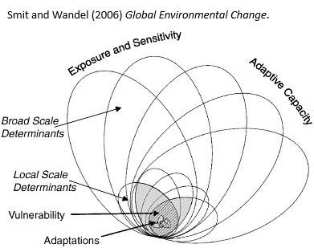
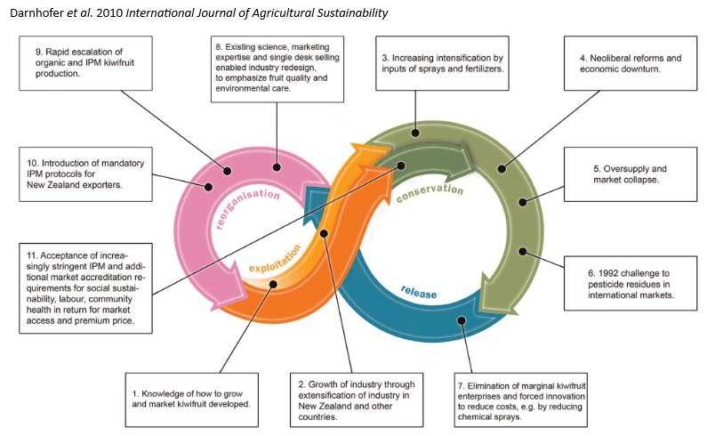
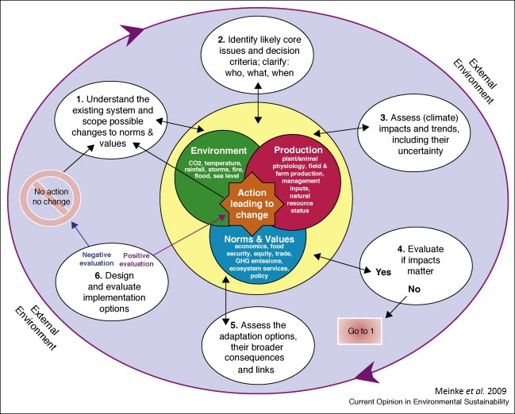
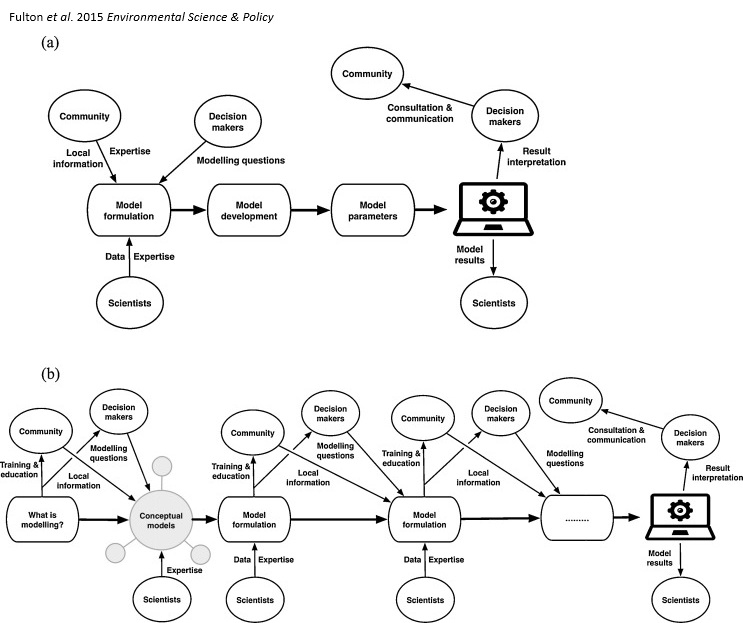
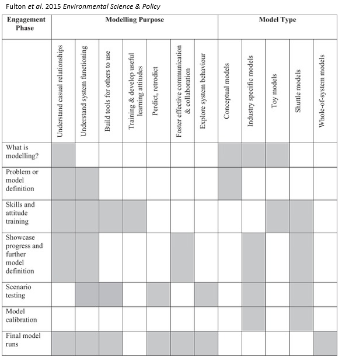
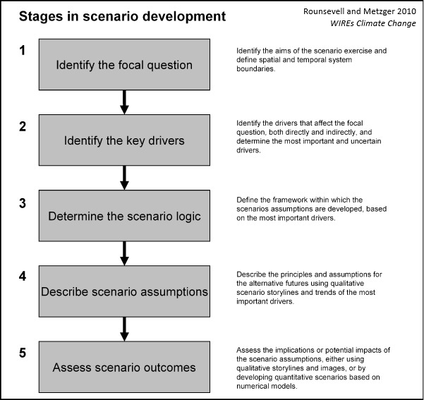
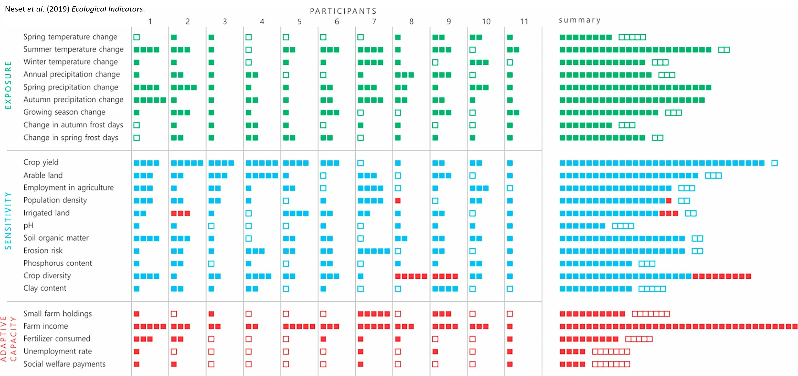

# Research context

## Yield gap

@bommarcoExploitingEcosystemServices2018
- Ecological intensification
  - yield gap = difference between what is actually produced on farms in a region & the potential primary production, given the climatic & edaphic conditions at that location, & with no losses to pests
  - resource use efficiency gap = enhancing output in relation to input
- Pest control objectives
  - to devise locally adapted practices that provide targeted support for beneficial organisms
  - to better understand how natural enemy communities should be composed to deliver stable & sufficient services
- Solutions
  - agricultural landscape diversification
  - targeted diversification:
    - introduce food resources e.g. perennial vegetation
    - push-pull technique: maize intercropped with non-crop plant repellent (e.g. Desmodium) + trap plant attracting pests (e.g. Napier grass) along the border
- Perspectives for agricultural research
  - how species richness, community composition & interactions with communities determine flow & stability of ES & subsequently resource capture by the crop
  - how land use & other environmental factors affect the distribution, abundance & community composition of organisms contributing to crop production
  - how interactions between below and above ground subsidize or counteract primary production & infuence processes at ecosystem level
  - targets for agricultural innovation:
    - minimal environmental impact
    - increased resource use efficiency
    - flexibility & resilience to climate change or pest outbreaks
    - adaptation to local conditions

@vanittersumNarrowingEcologicalYield2025
- "Ecological yield gap"
  - common analytical framework to strengthen collaboration between agronomists & ecologists in assessing the contribution of ES within the wider array of inputs, management practices, technologies & biophysical limits that determine on-farm crop yields
  - definition: yield increase that could be achieved in a given context (climate x soil x cropping system) & at a given input level, by increasing the delivery of ecosystem services via ecological intensification practices which support crop growth & substitute external inputs
- European network: DEPHY in northern France, with Treatment Frequency Index -\> **QUESTION: how integrated will be the indicators for the vulnerability analysis to already existing European framework?**
- Ecological intensification practices:
  - crop rotation
  - intercropping
  - available organic nutrient sources coupled with synthetic nutrients
  - reducing soil tillage intensity
  - prolonging soil cover throughout the year
  - synchronizing resources to the crop's needs via biotic regulation
  - integrating habitat & plant diversity into farmed landscapes to support service provides such as pollinators & predators
- Limitations in the feasibility according to context -\> more attention needed to agronomic functions of ecological intensification practices & context of farm management, climatic conditions & soils
- Yield gap:
  - efficiency: increase in yield that can be achieved, at a given resource supply & in a given context, by using more efficient practices (e.g. precision fertiliser application)
  - resource: yield increase that could be achieved in the given context by providing more resources to the crop
  - technology: not-yet-realised yield difference between the potential yield & the yield achieved by highest yielding farms, hence reflecting the incapacity of current on-farm technologies to reach agronomic best practices (e.g. sub-optimal timing of planting & management, lack of effective pest management practices)
- Ecological yield gap
  - overlap with efficiency, resource & technology
  - e.g. legumes in crop rotation: N provision (resource) + rotation (technology)
- Input x ecological yield gap
  - input-yield production functions: how crop yields respond to an input depending on levels of other growth factors (limiting resources, abiotic & biotic stresses)
- Different mechanisms of ecological intensification impacting yield response curve:
  - increase in intercept (higher yield at zero input level) but same yield plateau: substitutive effect of practice
  - increase in slope, i.e. increase of marginal use efficiency, & higher yield plateau, i.e. shift in maximum yield: complementary effect of practice (e.g. reduced biotic stress)
- Adaptation to context:
  - substitutive practices less effective at high resource input levels but could be useful to increase yields at low input levels
  - complementary practices effective at both low & high input levels
- From field the farm-level
  - upscaling of practices that narrow the ecological yield gap at field level to their assessment at entire crop rotations & farming systems
  - e.g. economic viability of the farm when rotation with less profitable crops involved
  - temporal reliability and cost-effectiveness: profitability only after several years of application, stability under climate and environmental changes
- Research perspectives
    - ecological mechanisms and relationships underlying crop yields:
      - e.g. belowground ES provision, pest suppression by wild predators
      - interactions between crop nutrition & crop protection: resources will be used more efficiently if crop is well protected against weeds, pests & diseases
    - on-station experimental research to investigate single or few ecological intensification practices
      - long-term experiments that can account for variability, evolution & stability of effects
    - on-farm observations
      - benchmarking: to learn from the variation among farms & to identify what farms at the frontier do differently from others
      - measurements: type, timing, method of application...
      - challenge: accounting for many confounding factors & incomplete management information, but can be used to formulate hypotheses to be tested in experimental farms
    - on-farm experimentation
      - limited number of replications for farmer co-management feasibility, but larger number of farms

## Pest control

@agarwalModernTechnologiesPest2021
- Pest control strategies
  - Biological control: suppression of pest populations by natural ennemies (predators, parasites, competitors, diseases)
  - Microbial pesticides: relatively stable formulations of microorganisms that suppress pests by producing poisons, causing diseases, preventing establishment of other microorganisms, or other mechnisms
  - Pest behaviour-modifying chemicals: exploitation of the chemical signals used by living organisms to evoke specific behaviours from other organisms
  - Geneteic manipulation of pest populations: release into the pest population of individuals genetically altered to carry genes that interfere with the pest's reproduction or impact
  - Plant immunization: enhancement of plant resistance to pests by means other than breeding or genetic engineering
- Innovations
  - biorational products: pheromones or living microorganisms with low environmental impact (e.g. to lure pest towards killing agent)
  - insect growth regulators: synthetic insect hormones which prevent from reaching maturity
  - nontoxic heat treatments: kills through dehydration across all life stages
  - CRISPR technology: gene editing tool to regulate fertility & sex determination of insects

@zhouIntegratedPestManagement2024
- Integrated Pest Management: involves integration of multiple control methods, including cultural, biological & chemical, to maintain pest populations below economically damaging levels while minimising risks to the environment & public health
- Fundamental principles:
  - prevention through cultural practices e.g. crop rotation & sanitation
  - monitoring pest populations & their natural enemies
  - using economic thresholds to guide management decisions
  - employing a blend of biological, physical & chemical control methods
  - efficiency assessments
- **Prevention & cultural control methods**
  - *crop rotation*: sequential cultivation of dissimilar crops on a given field across multiple growing seasons
    - aim: spatiotemporal separation of host crops, trap crops & enhanced biodiversity
    - efficiency: crop selection & temporal organisation, crop diversity, length rotation cycle & strategic incorporation of cover crops or green manures
    - side benefits: increase soil fertility
  - *intercropping*: concurrent cultivation of multiple crop species within a single field
    - aim: ecological interactions between diverse plant species to establish agroecosystems limiting pest proliferation while enhancing the activity of natural enemies
    - underlying mechanisms: resource competition, physical barriers, allelopathy & habitat manipulation
    - efficiency: companion crop selection, spatial configuration, timing of establishment
    - side benefits: increase soil fertility, water use efficiency & mitigation risk for crop failure from abiotic stressors
  - *sanitation*: removal & destruction of pest-infested plant material, crop residus & other sources of pest inoculum from farmlands & surrounding areas
    - aim: shrink emergent pest population & prevent spread within & between cropping seasons
    - field-level & farm-level (disinfection equipment, storage & transporation facilities)
  - *resistance varieties*: rely on genetic diversity of crops to minimise adverse-effects of pests & diseases
  - aim: decrease pesticide dependence, minimise yield loss & enhance resilience
  - antixenosis: makes plant less attractive or suitable for feeding, oviposition or shelter
  - antibiosis: plant characteristics with direct adverse consequences on pest growth, development, reproduction or survival (e.g. secondary toxic metabolites, physical barriers)
  - tolerance: capacity of a plant to withstand/recover from pest damage without significant yield reduction
  - potential drawback: resistance development in pest populations
- **Monitoring & decision-making**
  - *scouting & sampling techniques*: monitor pest populations & negative effects on crop plants (visual inspection, sweep nets, sticky traps, pheromones traps, remote sensing technologies)
  - AI technology
    - insect identification based on image recognition & Deep Learning
    - forecasting model based on Machine Learning & neural networks
    - optimising monitoring infrastructure to improve predictive models
  - *economic injury levels* (pest population density at which the cost of crop damage equals the cost of control) & *action thresholds* (lower pest density to prevent populations from reaching EIL)
    - calculations from pest density, crop susceptibility & cost/benefit assessments management strategies
    - required knowledge: accurate monitoring data, pest damage relationships across different environmental conditions & crop phenological stages & propensity for multispecies pest interactions impacting crop yield
- **Biological control**
  - *natural enemies*: parasitoids, predators & pathogens regulating pest populations through predation, parasitism or infection
  - *Classical Biological Control (CBC)*: importation & establishment of natural enemies sourced from the native selection of the target pest
    - aim: long-term pest suppression by reestablishing the ecological balance between the pest & its natural enemy in the introduced range
    - efficiency: host specificity, climatic adaptability, reproductive potential & searching efficiency
    - risks: nontarget impacts on native species, unintended spread of introduced agents to new areas, possible interference with other IPM tactics
  - *Conservation biological control (CVBC)*: modifying the crop environment to favor the survival & performance of natural enemies
    - aim: enhance abundance, diversity & effectiveness of natural enemies in agroecosystems
    - conservation techniques: provision of alternative food resources, creation of shelters & overwintering sites, minimisation of broad-spectrum pesticide applications
    - augmentation techniques: cyclic release of externally grown natural adversaries to supplement existing populations or compensate their absence
  - *gene drives*: introduction of genetic traits limiting the fertility and/or lifespan of targeted pests
- **Chemical control**
  - *selective & targeted pesticide use*
    - required knowledge: pest life cycle, ecological interactions, population fluctuations, crop phenology & relationships within agroecosystems
  - *Resistance Management Strategies (RMS)*: prevent or delay the buildup of pesticide resistance in target pest populations
    - aim: mitigate the selection stress exerted by repeated pesticide applications on pest populations which faour the survival & reproduction of resistance individuals
  - *Biopesticides & naturally derived products*
    - microbial pesticides: bacteria, fungi, viruses & nematodes that are pathogenic to targeted pest species
    - essential oils (atomized powders, nanoemulsions, Natural Deep Eutectic Solvents): repellency, phytotoxicity, entomotoxicity
  - *Nanotechnology*
    - Nanoencapsulation of active ingredient: improve stability, solubility & controlled release
    - Nanoformulations: enhance penetration & translocation of pesticides within plant tissues

## Alternative strategies

### Semiochemical trapping

@raderschallSemiochemicallyAssistedTrap2025
- Aim: to test the efficiency of trap crops coupled with semiochemical trapping for pest management
- Crop: Faba bean
- Pest: broad bean beetle (*Bruchus rufimanus*): feed on pollen & lay eggs on developing pods
- Trap crops:
  - "plant stands that are, per se or via manipulation, deployed to attract, divert, intercept &/or retain targeted insects of the pathogens they vector in order to reduce damage to the main crop"
  - early flowering accessions more damaged: aim for an early flowering cultivar
  - challenge: early attraction but potential dispersal to main crop later on -\> either control agent (kill the pest) or enhanced attractiveness with semiochemicals
- Semiochemicals:
  - signals between individuals of same species (pheromones) or among different species (kairomones) to modify the behaviour of the recipient
  - kairomones in the shape of flower & pod scents attractive for broad bean beetles
- Methods
  - Landscape-scale experiment of 24 commercially grown faba bean fields with 12 pairs of treated & control
  - trap crop: Finnish faba bean cultivar with one-week earlier flowering
  - Capture: pan traps (2021) & white double-sided sticky traps (2023)
  - Measurements: egg number on pod, damage on bean (emergence hole)
- Analysis (lme4)
  - number of eggs per pod among treatment & transect combinations
    - response: number of eggs per pod
    - model: linear mixed effect model based on negative binomial distribution with a log link
    - random effect: transect nested & field pair ID (1\|Field_ID/treatment/transect)
  - proportion of damaged beans among treatment & transect combinations
    - response: total number of beans & number damaged beans per transect
    - model: generalised linear mixed effect model based on binomial distribution with a logit link
    - random effect: treatment nested within field pair ID (1\|Field_ID/treatment)
  - crop yield
    - response: bean weight per square meter
    - model: linear mixed effects model based on nomral distribution
    - random effect: 1\|Field_ID/treatment
  - number of plants/m2 & yield components among transect & treatment combinations
    - response: plants/m2 & pods per plant
    - model: generalised linear mixed effect model based on negative binomial distribution & a log link
    - random effect: 1\|Field_ID/treatment/transect
    - response: average number beans/pod & individual bean weight
    - model: linear mixed effects models based on normal distribution
    - random effect: 1\|Field_ID/treatment
  - assumptions: DHARMa package (distribution residuals, heteroscedasticity)
  - marginal & conditional R^2^: r2_nakagawa from *performance* package
  - interactions treatment x transect: post-hoc tests with *emmeans* package
- Findings: significant but modest reductions of bean damages -\> proof-of-concept but further questions for coast-benefit ratio

### Flower strips

@rodriguez-gasolPerennialFlowerStrips2026
- Aim: to assess the multifunctional effect of flower strip & their spillover to adjacent crops
  - pollinator abundance within field margins
  - natural enemy & herbivore abundance within field margins & spillover into adjacent cereal fields
  - biological pest control in adjacent fields
  - soil detritivore activity within field margins & in adjacent fields
- HYP
  - perennial flower strips enhance abundance of pollinators, natural enemies, herbivores & soil detritivore activity within margins
  - but these groups will not spillover
  - leading to lack of benefits for pest control or soil detritivore activity in adjacent crops
- Study design
  - "Sweden Blossom" initiative: https://hushallningssallskapet.se/vara-projekt-och-uppdrag/hela-sverige-blommar/
  - 10 pairs of sown perennial flower strips & spontaneous vegetation controls (same field except one case)
  - pollinators: flower visitors
  - natural enemies & pests:
    - yellow sticky traps for leaf-dwelling natural enemies & herbivores
    - pitfall traps for ground-dwelling natural enemies
  - arthropod community on crop tiller (count)
  - pest control: aphid predation rates with sentinel prey cards
  - decomposition rate: bait lamina strips
- Analyses
  - Data aggregation
    - plants: average
    - arthropods: sum
    - rates: proportions based on aggregated totals
  - GLMM Field margin x pollinator abundance
    - fixed effects: field margin habitat type
    - random intercept: field
    - response variables: % vegetation cover, total floral area, abundance hoverflies, honey bees, bumblebees & solitary bees
  - GLMM Field margin & adjacent crop x arthropod abundance & decomposition rate
    - fixed effects: field margin habitat type & crop type + two & three-way interactions
    - random intercept: field
    - response variables: abundance leaf-dwelling spiders, predatory beetles, predatory bugs, lacewings, predatory thrips, hoverflies, parasitic wasps, aphids, thrips, other herbivores, ground-dwelling spiders, carabid beetles, rove beetles & decomposition rate
  - GLMM field margin x arthropod tiller count & aphid predation
    - fixed effects: field margin habitat type, crop type & interaction
    - random intercept: field
    - response variables: natural enemies, aphids, thrips & aphid predation rates by leaf-dwelling & ground-dwelling arthropods
  - Distribution: negative binomial & beta-binomial distribution
  - Transformation: shrink transformation for variables bound between 0 & 1
  - Model validation: distribution appropriateness, overdispersion, underdispersion & zero inflation
  - Statistical significance: type III Wald chi2 test with ANOVA function from the *car* package
  - Post-hoc tests to evaluate significant interactions between fixed effects with pairiwse comparisons adjusted for multiple testing using Tukey's method
- Findings
  - Ha validated: perennial flower strips enhanced pollinator abundance & natural ennemies
  - Hb contradicted: spillover of most natural enemy groups in adjacent crop fields
  - hc validated: but no increased pest control, & indesirable tradeoff as herbivorous thrips were 1.37 times more abundant on crop tillers near flower strips

# WP1 - Vulnerability analysis

## Conceptual framework

### General - climate change

@smitAdaptationAdaptiveCapacity2006
- AIM: review the concept of adaptation of human communities to global change in the context of adaptive capacity and vulnerability
- Adaptation (in the context of human dimensions of global change) = process, action or outcome in a system to better cope with, manage or adjust to some changing condition, stress, hazard, risk, or opportunity.
- Pressure & Release model (PAR): identify environmental stresses of hazards & the progression  of social forces that contribute to vulnerability, including those that relate to adaptive capacity.
- Climate research: four common purposes
  - to assess the degree to which they can moderate or reduce negative impacts of climate change, or realise positive effects, to avoid danger
    - adaptations conventionally assumed or hypothetical
    - focus on the effect of assumed adaptations: estimate climate impact & the difference adaptation could make
    - does not
      - empirically investigate adaptations
      - examine actual processes of adaptation or adaptive capacity 
      - explore conditions facilitating or constraining adaptations
      - document decision-making processes
  - to investigate specific adaptation measures for a particular system to assess their relative utility & identify the best options
    - adaptations considered distinct & discrete
    - merit: benefit-cost, cost effectiveness & multiple-criteria procedures
    - does not (generally)
      - investigate processes through which adaptation measures are undertaken
  - to explore the relative adaptive capacity or vulnerability of communities
    - comparative evaluation based on criteria, indices & variables selected by researcher
    - vulnerability: "starting point" assumed to be measurable based on determinants selected *a priori*
    - surrogate measures of exposure or sensitivity & elements of adaptive capacity are estimated & aggregated to generate an overall vulnerability score
    - does not
      - identify processes, determinants or drivers of adaptive capacity & vulnerability as they function in each system
      - address policy & decision-making processes that deal with the conditions that can alter adaptive capacity & vulnerability -> implication implicit from outputs
  - to contribute to practical adaptation initiatives = to investigate the adaptive capacity & adaptive needs in a particular community to identify means of implementing adaptation initiatives or enhancing adaptive capacity
    - identification & development of particular adaptive measures tailored to the needs of that community
    - focus on documenting the way in which the system experiences changing conditions & the processes of decision-making that may accommodate adaptations
    - bottom-up approach, not designed to be aggregated at broader scale
- Vulnerability: a function of the exposure & sensitivity of a system to hazardous conditions & the ability/capacity/resilience of the system to cope, adapt, or recover from the effects of those conditions
  - broader stresses determine exposure & sensitivity through interaction environmental & social forces, & shape adaptive capacity through various social, cultural, political & economic forces, at local level
  - finer scale interaction: local vulnerability
  - adaptations: particularly expressions of inherent adaptive capacity
- Exposure & sensitivity: likelihood of a system experiencing particular conditions, & the occupance & livelihood of the system which influence its sensitivity to such exposure
  - occupance: broader social, economic, cultural, political & environmental conditions driving/determining exposure & sensitivity
  - many determinants of occupance or sensitivity similar to those that influence a system's adaptive capacity
- Adaptive capacity: defined by the conditions that a system can deal with, accommodate, adapt to, and recover from
  - relates to adaptability, coping ability, management capacity, stability, robustness, flexibility & resilience concepts
  - drivers adaptive capacity: forces that influence the ability of a system to adapt
  - local adaptive capacity function of broader conditions, can be influenced by: managerial ability, access to financial, technological & information resources, infrastructure, institutional environment within which adaptations occur, political influence, kinship networks...
  - context-specific in terms of value & nature
  - thresholds, coping ranges: flexible, respond to changes in economic, social, political & institutional conditions over time
  - limited predictability: warm, wet years increase crop production, but can also favour pest outbreaks -> hard to predict overall effect on yield
- Adaptations: manifestations of adaptive capacity, to better deal with problematic exposures and sensitivities
- General principles for practice
  - for the researcher not to presume to know the exposure & sensitivities that are pertinent to the community
  - for the research not to specify a priori determinants of adaptive capacity in the community
  - participatory assessments 
    - allow for the recognition of multiple stimuli beyond those related to climate, including political, cultural, economic, institutional & technological forces
    - recognise interaction of various exposures, sensitivities & adaptive capacities over time (not linear, what is vulnerable for x period is not for y)
    - recognise that sources of exposures, sensitivities & adaptive capacities function across scales, from individual to national
  

@gallopinLinkagesVulnerabilityResilience2006
- AIM: systemic perspective to identify & analyse the conceptual relations among vulnerability, resilience & adaptive capacity within social-ecological systems
- Vulnerability: most often conceptualised as being constituted by components that include exposure to perturbations or external stresses, sensitivity to perturbation, and the capacity to adapt [@adgerVulnerability2006]
  - multiscale nature of the perturbations & their effects upon the system
  - most SES exposed to multiple, interacting perturbations
- Perturbation, stress, hasard, or shock
  - perturbations: major spikes in pressure beyond the normal range of variability in which the system operates, & commonly originate beyond the system or location in question
  - stress: continuous or slowly increasing pressure, commonly within the range of normal variability
- Sensitivity: degree to which the system is modified or affected by an internal or external disturbance or set of disturbances
  - "extent to which a human or natural system can absorb impacts without suffering long-term harm or other significant state change" [@adgerVulnerability2006]
  - exposure-sensitivity represents a unified concept for some authors
- Capacity of response: system's ability to adjust to a disturbance, moderate potential damage, take advantage of opportunities, & cope with the consequences of a transformation that occurs
  - also coping capacity or adaptive capacity
- Exposure: degree, duration and/or extent in which the system is in contact with, or subject to, the perturbation
  - whether to include exposure as a component of vulnerability or not
    - if included, vulnerability becomes a property of the relationship between the system and the perturbation, rather than of the system itself
    - if excluded, vulnerability is a property of the system only, expressing itself when the system is exposed to the perturbation
- Resilience
  - basin of attraction: portion of the state space of a dynamic system that contains one attractor toward which the state of the system tends to go, and is therefore one region of the state space where the system would tend to remain in the absence of strong perturbations
  - attractor: what the behavior of a system settles down to
  - stability landscape: configuration of all basins of attraction, including the boundaries separating them
  - when multiple attractors: a continuous variation in some critical parameter can result in discontinuous changes in the stability landscape of the system -> bifurcations (mathematical theory dynamical systems) or catastrophes (catastrophe theory)
  - three levels of stability
    - local stability or engineering resilience: behaviour of trajectories of the system in the neighbourhood of an attractor, within a given domain of attraction
    - ecological resilience: capacity of the system to remain within the same domain of attraction (assess changes between domains of attraction within the stability landscape of the system)
    - structural stability: capacity of a system to preserve the topology of its trajectories under perturbations of the dynamic equations of the system ("true" transformation of a system)
- Adaptive capacity: ability of a system to adjust to climate change to moderate potential damages, to take advantage of opportunities, or to cope with the consequences (IPCC)
  - two components for SES
    - capacity to cope with environmental contingencies
    - capacity to improve its condition in relation to its environment (often left behind by more recent use of the term adaptive capacity - e.g. IPCC definition too restrictive)

@hinkelIndicatorsVulnerabilityAdaptive2011
- AIM: to develop a rigorous conceptual framework for vulnerability indicators & apply it to review scientific arguments available for building climate change vulnerability indicators
- Vulnerability concept: a measure of possible future harm
- IPCC definition
  - "the degree to which a system is susceptible to, and unable to cope with, adverse effects of climate change, including climate variability and extremes. Vulnerability is a function of the character, magnitude, and rate of climate change and variation to which a system is exposed, its sensitivity, and its adaptive capacity"
  - challenging to make this definition operational as defining concepts vague themselves & lack of clarity on how they are combined
- Vulnerability indicators
  - operational definition: transparent and rigorous methodology of a vulnerability assessment
  - composite indicator: maps or aggregates a vector of observable variables to one scale theoretical variable
  - 1st step: definition of what is to be indicated (e.g. the vulnerability of an entity to climate change)
    - entities can usually be characterised as social-ecological systems
    - define entity includes defining the system's boundaries
  - 2nd step: selection of indicating variables
    - to define the domain of the indicator function
  - 3rd step: aggregation of the indicating variables
  - two main challenges
    - how to exactly define the vulnerable entity, especially by taking into account the wide political, institutional, economic & social context
    - how to include the forward-looking aspect of vulnerability: predictive models
      - indicator-based approaches: function simple & time-independent
      - simulation-model-based approach: function complex & time-dependent
- Available arguments to develop vulnerability indicators
  - deductive arguments: based on existing theory (scientific knowledge)
    - selection variables for social sub-system
      - broad/global scale
        - "root causes" of vulnerability
        - 8 determinants of adaptive capacity introduced by the IPCC [@yoheIndicatorsSocialEconomic2002]
      - local scale
        - social capital
        - Livelihood Vulnerability Index
    - selection variables for bio-physical sub-system
      - integrated assessment models: applied in combination with harm indicators through top-down simulation-model based approach (simulation possible future states of vulnerable systems & then evaluation based on harm indicators)
      - e.g. Advanced Terrestrial Ecosystem Analysis and Modelling (ATEAM)
    - aggregation variables: expert judgement -> but failure to reach consistent results across expert groups [@brooksDeterminantsVulnerabilityAdaptive2005]
  - inductive arguments: based on data of both indicating variables & observed harm (statistical models)
    - conditions for statistical modelling
      - systems can be narrowly defined, using few variables
      - sufficient data is available
  - normative arguments: based on value judgment
    - normative argument of equal weight frequently used in aggregation -> implies indicating variables as perfect substitutes
    - how to deal with aggregation
      - directly involve stakeholders
      - not aggregate & use vector-valued indicators                             
  - non-substantial arguments: based on data of indicating variables only (irrespective of knowledge on vulnerability)
    - co-variation or multi-variation: to reduce the number of variables
    - robustness: applying alternative methods of aggregation & evaluating the resulting rankings
    - data availability
- Fit for purpose
  - assessing vulnerability
    - in general, the purpose of indicators is to describe the state of affairs of a complex system in simple terms
    - however actual use of indicators for policy-making usually vague (e.g. "to help preparing EU-wide adaptation policy")
  - to identify mitigation targets
    - not suitable for climate change due to global scope: earth system & global integrated assessment models are complex and cannot be collapsed into a simple indicator function
  - to identify particularly vulnerable people, regions or sectors
    - suitable at local scales, when systems can be narrowly defined by few variables
    - not suitable for larger scales, rely on simulation-model based approaches instead
  - to raise awareness of climate change
    - not suitable, because of risk of communication
  - to allocate adaptation funds to particular vulnerable regions, sectors or groups of people
    - not suitable: countries should address the known issues by negotiating national priorities & developing issue-specific programs & projects
  - to monitor the performance of adaption policy
    - not suitable: 
      - outcome indicators (successful outcome of adaptation policy): harm indicators, not vulnerability
      - process indicators (monitor adaptation process itself): institutional stages, not vulnerability
  - to conduct scientific research
    - not suitable: lack of specificity creating confusion around the concept of vulnerability
- Discussion
  - logical steps defined by the IPCC:
    - assess exposure with climate models
    - assess sensitivity of the exposed entities with damage functions or impact models
    - "correct" potential impacts by assessing adaptive capacity
  - however, not necessarily adequate for all questions & contexts, thus should not be considered as a blue-print for assessing vulnerability
  - blurred differences between vulnerability components: challenging to decide to which of these three components indicating variables should be attributed to
  - lack of deductive arguments for aggregating indicating variables & lack of inductive arguments at larger scales
- Clarify science-policy interface
  - vulnerability indicators should only serve as high.level entry points to further more detailed information
  - be explicit & specific about problems addressed
  - transparency of the different types of arguments used in developing indicators
  - normative arguments should be made explicit & be based on the preferences of relevant stakeholders
  - background information to prevent misinterpretation
  - should be updated regularly, based on new research findings

@brooksDeterminantsVulnerabilityAdaptive2005
- AIM: to determine national-level indicators of vulnerability and adaptive capacity to climate change
- Conceptual framework:
  - risk
    - probabilistic
      - probability of occurrence of a hazard that acts to trigger a disaster or series of events with an undesirable outcome (e.g. climatic hazards that trigger climate-related disasters)
      - probability of a disaster or outcome, combining the probability of the hazard event with a consideration of the likely consequences of the hazard
    - quantitative measures of outcome as proxies (e.g. data related to adverse socio-economic impacts as a retrospective measure of historical risk)
  - vulnerability
    - inconsistent relationships between vulnerability & sensitivity in the IPCC TAR
      - glossary: vulnerability is "the degree to which a system is susceptible to, or unable to cope with, adverse effects of climate change, including climate variability and extremes. Vulnerability is a function of the character, magnitude, and rate of climate variation to which a system is exposed, its sensitivity, and its adaptive capacity" (sensitivity as component of vulnerability)
      - in working group II: vulnerability is "the degree to which a system is susceptible to injury, damage, or harm (one part - the problematic or detrimental part - of sensitivity)", while sensitivity is "the degree to which a system is affected by or responsive to climate stimuli"
    - context-dependent
      - nature of the system (social, economic, political, environmental factors), type of hazard
      - generic determinants (apply to most cases): poverty, health status, economic inequality, governance...
      - specific determinants (particular context & hazard type): price particular food crop, number of storm shelters...
  - adaptive capacity: time-dependent
    - vulnerability to anticipated hazards in the medium to long-term depends on the system's ability to adapt in anticipation of those hazards
    - vulnerability to hazards that may occur in the immediate future is related to a system's existing short-term coping capacity
- Methodological approach
  - literature review, expert judgement & data availability: shortlisting of 46 variables of generic vulnerability
  - data treatment
    - averaging at decade level
    - data series: each datum represented a specific country in a specific decade
  - correlation analysis
    - mortality risk proxy series x vulnerability proxy series
    - Monte-Carlo randomisation procedure according to @ebisuzakiMethodEstimateStatistical1997
      - calculates probability that the correlation between a pair of series is exceeded when the data are randomised
      - accounts for autocorrelation
    - key indicators of vulnerability: significant correlation with mortality at the 10% level
    - limitations: does not address the influence of hazard type, frequency & severity on mortality outcomes
  - expert elicitation
    - expert judgement to validate the empirical determination of the key indicators of vulnerability
    - weighing & interpretation of indicators: multiple ranking exercises, distinction vulnerability/adaptive capacity
  - construction composite indices
    - limitations composite: high degree of data heterogeneity across countries, averaging
    - composite vulnerability index
      - for each key indicator, data divided into quintiles
        - (+) correlation with mortality: country in 1st quintile assigned 1, country in 5th quintile assigned 5
        - (-) correlation with mortality: country in 1st quintile assigned 5, country in 5th quintile assigned 1
      - score 1-5, from low to high vulnerability
  - sensitivity of country vulnerability rankings to different developmental contexts
    - prioritise variable according to the strength of the correlation with mortality outcome
    - issue independence: may over-emphasise the importance of factors represented by multiple related variables
    - indicator rankings from the focus group converted to weights, themselves applied to key vulnerability indicators
      - each set of rankings from focus group would generate an individual composite index
      - country rankings compared across composite indices to assess the impact of different weightings in the results
  - identify vulnerable countries
    - combined assessment of country rankings in multiple composite indices based on a variety of weighing sets
    - significantly vulnerable countries: top quintile in at least one of the composite index
    - most vulnerable countries: top quintile for most of all alternative composite indices
- Focus group analysis
  - emerged distinction between short-term (months), medium-term (years) & long-term (decades)
  - preferences for indicators linked to causation (e.g. access to sanitation, calorie intake) rather than outcomes (e.g. terminal life expectancy at birth)
  - different strategies for ranking
    - address vulnerability & adaptive capacity separately
    - different sets of rankings for different vulnerability hazards and contexts (e.g. flood hazards vs coastal zone hazards in general)
    - general rankings for all hazards
- Variability in country vulnerability
  - average difference in country rankings between pairs of composite indices as the sum of differences between rank country i in index m and rank country i in index n, divided by the number of countries represented in each index
    - greatest differences for sets of weightings representing adaptive capacity to drought, crop failure & famine, & vulnerability to sea level rise
    - smallest differences for sets representing generalised adaptive capacity, aggegated vulnerability & adaptive capacity
  - assessments of vulnerability or adaptive capacity based on individual country rankings generally not appropriate, due to the variation in rank across indices & data availability issues

@brunosoaresConceptualElementsClimate2012
- AIM: to review conceptual elements regarded as critical in integrated assessments of climate change vulnerability
- Vulnerability in climate change research
  - biophysical approach: 
    - addresses the vulnerability & degradation of environmental conditions & extrapolates these in terms of potential impacts on humans (e.g. distribution hazardous conditions, human occupancy in hazardous areas)
    - "end-point" (outcome of impact minus adaptation): provide an understanding of climate change impacts & inform decision-making regarding the costs of adaptation vs costs of mitigation
    - risk-hazard approach or impact-driven studies: focuses on magnitude, duration & impact of exposure
  - social approach:
    - socially constructed processes & structures (social, political, historical, economic) impacting on individuals/groups which can lead them to vulnerable conditions
    - external side: perturbations & risks the system is subjected to
    - internal side: system's own capacity to cope & respond to hazardous events
    - "starting-point": contextual vulnerability as a dynamic state
  - integrated approach: addresses both biophysical & social dimensions of vulnerability
- Methodological approaches
  - Climate Impact Assessment
    - largely based on the biophysical perspective of vulnerability
    - IPCC methodology conventional approach
    - limitation global assessment environmental risks without taking into consideration local contexts
  - Vulnerability Assessment
    - more bottom-up approaches, based on integrated perspectives on vulnerability
    - greater emphasis on stakeholder engagement, socio-economic scenarii, adaptation measures, decision-support tools & enhancement of adaptive capacity
  - Adaptation Assessment
    - focuses primarily on information requirements of stakeholders for policy development & facilitation of decision-making processes
    - blurry line between adaptation & vulnerability assessments
- Conceptual elements
  - Coupled human-environment system (SES)
    - identification attributes of concern within a system
    - delimiting the geographical area
    - limitation: proper understanding of the interactions between humans & the environment in the SES
  - Key components of vulnerability
    - exposure = the nature and degree to which a system is exposed to significant climatic variations
    - sensitivity = the degree to which a system is affected, either adversely or beneficially, by climate variability or change
    - adaptive capacity: ability of a system to adjust to climate change to moderate potential damages. to take advantage of opportunities, or to cope with the consequences
    - relationships between components
      - exposure can be external (vulnerability only intrinsic property of SES) or internal (vulnerability results from the interaction between the system & the exposure)
      - vulnerability & adaptive capacity broadly perceived as negatively correlated
      - main limitation in studies: lack of clarity on the dynamics between key components & their relative importance in generating/reducing vulnerability
  - Multiple perturbations
    - using past experiences of vulnerable situations & working backwards towards identifying the perturbations that led to those instances
    - focus on particular unwanted outcomes & works backwards through the causal structures in order to identify the stresses most likely to generate those unwanted outcomes
  - Scales of analysis
    - human & environmental components of the coupled system may operate at disparate spatial, temporal or functional scales
    - choice of analytical & methodological approaches (top-down or bottom-up) can lead to fundamentally different interpretations of the same phenomenon
    - hierarchy theory can be used to scaling both biophysical & social data as ut allows the consideration of the various levels of spatial & temporal resolution from both dimensions of the coupled system
  - Causal structures of vulnerability
    - causality largely underpinned by political economy & political ecology research traditions emphasizing the role of socio-economic & political factors
    - Pressure-and-Release model: attempt to explain the processes & mechanisms leading to people's vulnerability in a disaster risk context, based on three interconnected levels (root causes; dynamic pressures; unsafe conditions)
  - Differential vulnerability: unequally distributed across the coupled system
  - Engaging stakeholders
    - knowledge co-production: requires considerable commitment towards stakeholder participation and interaction in the research process, interdisciplinarity & production of applicable knowledge
    - limitations: lack of resources, political constraints, & the level of suitability between science & stakeholders' needs and expectations
  - Historical & prospective analysis
    - in vulnerability analyses, the starting point is to understand the current vulnerability of the coupled system
    - for future vulnerability: projections and scenarios, either deterministic or probabilistic
  - Dealing with uncertainty
    - further exacerbated by spatial & temporal mismatches, non-linear processes & self-organisation within the coupled system
    - assess-risk-of-policy framework: to support robust decision-making against currently known uncertainties
    - need for more iterative, strategic and flexible mechanisms for the implementation & monitoring of adaptation measures & strategies against new knowledge, for instance by continuously monitor & evaluate the implementation of the adaptation strategy

@janssenScholarlyNetworksResilience2006
- AIM: bibliometric analysis of the knowledge domains resilience, vulnerability & adaptation in the research on the human dimensions of global environmental change between 1967 & 2005
- Resilience "determines the persistence of relationships within a system and is a measure of the ability of these systems to absorb change of state variable, driving variables, and parameters, and still persist" [@hollingResilienceStabilityEcological1973]
- Vulnerability: "the characteristics of a person or group in terms of their capacity to anticipate, cope with, resist, and recover from the impact of a natural hazard. It involves a combination of factors that determine the degree to which someone's life and livelihood is put at risk by a discrete and identifiable event in nature or in society" [@blaikieRiskII2nd2014]
- Adaptation: "adjustment in ecological, social, or economic systems in response to actual or expected climatic stimuli and their effects or impacts. This term refers to changes in processes, practices, or structures to moderate or offset potential damages or to take advantage of opportunities associated with changes in climate. It involves adjustments to reduce the vulnerability of communities, regions, or activities to climatic change and variability" [@mccarthyClimateChange20012001]

### Agriculture

@darnhoferAssessingFarmsSustainability2010
- AIM: to conceptualise the farm as a multiscalar, complex and dynamic system from the resilience perspective
- Farming system resilience
  - Nature of change
    - large number of decisions made by many individual agents (farmers, policy makers, consumers) in response to their preferences & perceptions of their contexts -> complex interactions making future developments unpredictable
    - long periods of gradual change & relative stability, interrupted by shorter, episodic disturbances that can reconfigure the entire system (shocks)
    - different types of changes according to speed & predictability
      - stress: enduring pressure, predictable to some extent (e.g. agricultural intensification)
      - shock: sudden disruption (e.g. 1970s oil price crises)
  - Individual farm system within broader farming system
    - farm unit
      - the farmer: social & cultural capital including mental models, preferences, goals, abilities...
      - the physical farm: natural & economic capital including land, animals, crops, building, finances...
    - various subsystems semi-autonomous: long-term adaptive cycle with mutual influences between spatial scales and other domains - *or how to maintain the capitalist system by sustaining its recurring crises*
      - exploitation phase: knowledge-building & market development
      - conservation: expansion, intensification & exploitation until market crises (neo-liberal reforms)
      - release: concurring shocks exposing the vulnerability of the system
      - reorganisation: regulations, policymaking (*et c'est reparti pour un tour*)
    - international food system
      - ecological domain: balance pests/beneficial insects, water cycle
      - social domain: norms, expectation urban population
      - economic domain: market pressures, quality standards
    - subsystems evolve at different speeds, potential temporal & spatial mismatches (e.g. rapid shift in consumer preferences following food-safety crisis vs slow erosion genetic material breeds & cultivars)
- Challenges for farm management
  - what combination of strategies is most likely to allow a farm to successfully navigate change?
  - persistence, safe for relative stable states (e.g. exploitation, conservation)
    - stress: exploit current strengths & focus on efficiency
    - shock: absorb without initiating major changes
  - adaptation, usually needed in times of global crises (e.g. release, reorganisation)
    - stress: adjust by reconfiguring resources or starting new related activities
    - shock: transform into a fundamentally new system (e.g. diversification activities previously considered as beyond the realm of farming)
  - trade-offs between attributes associated with stability (e.g. yield production) & those required for transformation (e.g. crop diversity)
- Crucial role of the farmer
  - day-to-day management shaped by economic framework, social norms, local agroecosystem & farm structure, but in the end determined by the farmer's perceptions, preferences & risk aversion
  - farmers emphasize social components (e.g. family needs & satisfaction) as key factors in their choices regarding production methods & farm strategy
  - transformative resilience: ability of farmers, facilitators and agricultural policy to deliberately steer a farming system away from a tipping point into configurations where shocks can be buffered
  - different interpretations of ecological linkages according to farmers' mental structures and material circumstances
- Assessing resilience of individual farms
  - challenge: how to convert the abstract & multidimensional concept of resilience into applicable measures to guide adaptive transformations
  - approach: develop a set of surrogates (indicators) addressing the multiple aspects that contribute to the resilience of farms
  - temporal hurdle: surrogates may change as the farm evolves
    - how to capture dynamics of change & unknown prospects
    - ask whether the farm transforms into a less or more sustainable and resilient orientation rather than assess whether the farm is fit at a specific moment in time
  - spatial hurdle: surrogates may be place dependent
    - according to national policies & decision-making (liberal systems, subsidies)
    - farm resilience cannot be assessed *per se* but according to its current ecological, economic & political contexts
  - human hurdle: how as same set of surrogates can have different interpretations
    - farm structure in itself does not reflect the complexity of farmers' decision-making, goals & preferences
    - farm is a product of
      - past history (path dependence)
      - time lags (learning processes, measure implementations)
      - unintended consequences of past choices
      - limitation of current economic & social environment
    - participatory approach necessary to establish & assess resilience surrogates prior to a "remote assessment" of scientists
- General rules from the ARGOS program (Agriculture Research Group On Sustainability, New Zealand)
  - take a broad "big picture" view of threats, and opportunities, and the quality of ouctomes from different choices
  - establish and heed far-reaching & accurate information networks to provide accurate & early warning of impending crises
  - build trust among stakeholders in the information provided about threats, need for change and viable options for change
  - consider the most complete set of choices, including those beyond the current experience of farmers & agricultural process professionals
  - use all forms of knowledge to identify & realise better choices
  - use flexible planning structures & processes, & active networks to support choice making and putting the choices into action
  - build a strong infrastructure around farming families for learning & support, exchange of knowledge & promotion of access to resources
  - foster a strong sense of purpose, place & belonging to a local, national & international community to strengthen the determination to persist or to transition
  - build confidence & optimism among individual farmers & their industry
  - squarely confront change when needed, tempered by realism & steadiness to prevent panic
  - build strong leadership of the local community or industry to negotiate risk & change, build confidence in grassroots participants, inform on viable options...
  - learn to live with uncertainty, admit mistakes, and try again if an innovation is not working at first try
  - ensure equitable & rapid access to resources
    

@meinkeAdaptationScienceAgriculture2009
- AIM: to develop a conceptual framework ensuring broad-based scientific input and feedback to increase the adaptive capacity of agriculture
- Adaptation science: 
  - process of identifying & assessing threats, risks, uncertainties & opportunities that generate the information, knowledge, & insight required to effect changes in systems to increase their adaptive capacity & performance
  - solution-oriented, scientific endeavour in the global agenda to facilitate adaptation actions
- Risk management & adaptation at different scales
  - science input demand often broad, general & vague vs supply narrow, specific & precise
  - increase scientific relevance by embedding approaches within context-specific & multi-stakeholder dialogues
  - proactive adaptation process: quantitative knowledge about the function, use & consequences of enabling & transformational approaches & technologies complementary to existing empirical knowledge
- Synergy between knowledge & action by facilitating communication
  - adaptation cycle
    - 1/understand the existing system & scope possible changes to norms & values
    - 2/identify likely core issues & decision criteria (who, what, when)
    - 3/assess impacts & trends, including their uncertainties
    - 4/evaluate if impacts matter
    - 5/assess the adaptation options, their broader consequences & links
    - 6/design & evaluate implementation options
  - feedback needed at each step of the cycle
  - outcomes-focused models embedded in participatory & adaptive governance & decision-making processes
- Modelling, systems thinking & operational risk management
  - negotiation process for participants to have a common understanding of the system's boundaries -> draw attention to contested norms & values
  - evaluate effectiveness of potential innovations at various levels of integration
  - agricultural typical examples of complex adaptive systems
    - order emerges rather than being predetermined
    - history of the system largely irreversible
    - the system's future can only be predicted probabilistically
  - identify the leverage points where incremental or transformative intervention can be supported by an adaptive policy environment
- Bridge between practice, policy & society
  - technical innovations could provide partial solutions for most sustainable production, but need to be assessed against their broader biological, economic & social consequences
  - social capital:
    - bonding: interactions characterised by personal trust & reciprocity within homogeneous social networks
    - bridging: interactions characterised by trust & reciprocity that extends beyond homogeneous social networks to members of heterogeneous social networks
    - linking: facilitates access to resources necessary to implement collective action
  - multi-scale modelling
    - upscaling from an understanding of crop physiological responses to enterprise-scale options
    - downscaling from an understanding of global environmental conditions to farmers income and the long-term sustainability of their resource base

## Methodological approach

@Agrowise
- INRAE PROJECT: Guidelines for farm-specific or crop-specific rules for mitigating pesticides impacts while ensuring sustainable agriculture.

@mathisComparisonExemplaryCrop2022
- AIM: multi-criteria analysis to investigate trade-offs in different apple production systems in Switzerland
- Crop protection strategies
  - PEP2018 Swiss: Proof of Ecological Performance of 2018
  - PPP reduced: principles of integrated production system aiming at minimising PPP & residues without causing yield loss
  - High yield: conventional system, yield maximisation, risk minimisation
  - Organic: prohibition synthetic PPPs & mineral fertilisers
- Indicators
  - PPP use: Treatment Frequency Index summarising number of product applications & dosage applied
  - local ecotoxicological risk: model SYNOPS to assess local ecotoxicological risk of PPP on organisms living in edge-of-field surface waters, agricultural soils & terrestrial off-crop habitat
  - global environmental impacts: 
    - Swiss Agricultural Life Cycle Assessment method SALCA
    - freshwater ecotoxicity, eutrophication potential, resource use, global warming potential & biodiversity
  - economic impacts
    - profitability: farmer's hourly wage
    - production risks: yield fluctuations
    - financial autonomy: invested capital
    - workload: labour input

@lechenetReconcilingPesticideReduction2014
- AIM: to assess the sustainability of 48 arable cropping systems from two major agricultural regions of France (conventional, integrated & organic systems) based on a set of economic, environmental & social indicators
- Cropping system classification
  - organic
  - integrated: diversified crop rotations or at least including one non-chemical pest control approach
  - conventional: neither organic nor integrated
- Local reference definition: to reflect the most widespread crop rotation & associated technical management as well as typical agricultural performance in the production situation -> to distinguish effects of agronomic strategies from the effects of the production situation
- Indicators
  - Treatment Frequency Index: summarises level of dependence on pesticides
  - productivity: amount of energy harvested yearly
    - allow comparison of different crop rotations with range of yielding potentials & different energy content
    - transformation crop yield into energy value: Lower Heating Value = amount of energy released per unit of mass by the combustion of the harvested biomass
  - energy consumption: conversion of inputs into energy
    - Dia'terre database: evaluate a carbon-energy balance at farm-scale
    - e.g. calculation energy cost associated with the production of nitrogen fertilisers integrates the energy necessary from raw material production, through materials processing, manufacture & distribution
  - energy efficiency: ratio between productivity & energy consumption
  - economic productivity:
    - gross product: conversion crop yield into economic value
    - semi-net margin: gross product/ha minus input costs = profitability without incentives/subsidies
    - sensitivity to price volatility: relative deviation of semi-net margin over ten contrasting real price scenarios between 2000 & 2010
  - fuel consumption & workload
  - environmental impact: cumulated I-Pest = measures risk for air, surface water & groundwater
  - crop sequence indicator Isc: quantify agronomic effects of crop diversification
  
@martinIntegratedMethodAnalyze2017
- Vulnerability: function of exposure & sensitivity of a system to a range of hazards & the adaptive capacity of the system to cope with, adapt to, or recover from the effects of these conditions
  - exposure: duration, extent & frequency of perturbations
  - sensitivity: degree to which system responds to perturbations
  - exposure & sensitivity determine the potential impact given perturbation variability
  - adaptive capacity: degree to which system can adjust to, moderate, or offset the potential impacts, or take advantage of opportunities created by given events
  - actual impact: impact that remains after accounting for adaptive capacity
- Model-based studies (*ex ante*):
  - enable strict application of the vulnerability framework by isolating farm sensitivity from adaptive capacity
  - drawbacks:
    - limited ability to reproduce farm management & production when applied to new sites
    - simulation of farm adaptations in simplified context ignoring key issues to farmer
- Field-based studies (*ex post*):
  - consider multifactorial context farmers encounter
  - drawbacks:
    - vulnerability cannot be broken down into exposure, sensitivity & adaptive capacity
    - sensitivity not measurable since farmers often react to adverse events by implementing adaptations
- Methodology objectives
  - assessing farm vulnerability to the drivers of multiple contextual changes
  - explaining this vulnerability as a function of initial farm configurations & farmers' multiple technical adaptations
- Main principle: farm vulnerability as a function of three main components of linear regression over time
  - mean level: raw measurements of vulnerability variables (or fitted/mean values)
    - high measurement values =\> towards "good" mean performance
  - general trend over the period: slope of the linear regression of these measurements over time
    - stable or increasing trend =\> towards improvement
  - variability: residuals of the linear regression
    - low =\> towards stability & robustness
- Step 1: choosing vulnerability & explanatory variables (expert knowledge)
  - productivity (e.g. kg protein/ha/year) & economic efficiency (e.g. %/year)
- Step 2: calculating farm-specific vulnerability variables
  - regression for each vulnerability variable as a function of the year to extract trend & residuals
  - performed for all farms, surveyed farms being as random sample from entire farm population
  - linear mixed models with random-coefficient regression
    - overall mean = intercept common to all farms
    - overall trend = slope common to all farms
    - random deviation from the overall mean for each farm
    - random deviation from the overall trend for each farm
    - residuals provide additional measures of stability
    - random rather than fixed effect: extreme values lessened in a random model, which avoids over-emphasizing outliers
  - each farm is characterised by
    - its level at the beginning of the period expressed (intercept), as a deviation from the overall performance level of all farms
    - its trend over the period, as a deviation from the overall trend
    - the variability around the expected trajectory
- Step 3: characterising the diversity of farm vulnerability patterns
  - descriptive analysis: PCA of all vulnerability variables
  - identify relationships among vulnerability variables (+/- correlations)
  - identify patterns of farms' vulnerability trajectories
- Step 4: understanding farm vulnerability from explanatory variables
  - partial least squares regression: to reduce dimensionality & search for the maximum covariance between response & explanatory variables
  - PLS predicts multiple vulnerability variable from two types of explanatory variables (climatic and economic exposure variables) & variables describing initial farm configurations & farmers' technical adaptations over time
- Explanatory variables
  - exposure - related to natural & economic threats
  - adaptive capacity - related to management
  
@fouilletDiversityPesticideUse2023
- Change intensity in pesticide use: Efficiency, Substitution and Redesign framework (ESR)
  - efficiency (e.g. dose reduction) & substitution (e.g. biocontrol) associated with progressive transition
  - redesign (e.g. conversion to organic farming) associated with abrupt & direct transition
- Transition path:
  - succession of linear periods, which determine the possibility of a system to go in one direction but being interrupted by a nodal point
  - can be characterised by the initial point, the effect of the transition (direction & intensity) & the trajectory
- Farm typology
  - simplify & group a variety of farm cases into fewer types to better understand this diversity
  - used to assess & explain the differences between farming systems undergoing changes
- Methodology
  - Treatment Frequency Index (TFI) = sum, for each pesticide product applied during the crop season, of the ratio between the applied dose & the full registered & recommended dose
  - Indicators to build the typology according to farm performances
    - initial normalised TFI (starting point)
      - ratio between initial individual TFI & regional TII
      - normalised to eliminate region effect
      - reflects the intensity of pesticide reduction compared to other farms in the same region
    - final TFI (ending point)
      - mean TFI for the last 3 years (to limit year effect)
      - un-normalised value
    - regression slope (general trend)
      - path taken over 10 years
    - sum of square deviation (overall variability farming system)
    - maximum variation (robustness & variability)
      - maximum residuals having the largest absolute value
    - slope break (ruptures)
      - two-piecewise continuous linear regressions: assume the existence of a breakpoint at the junction of two-line segments
  - Explanatory indicators describing phytosanitary strategies
    - type of product: biocontrol (macroorganisms, microorganisms, chemical mediators, natural substances), copper products
    - applied dose per treatment (fungicides, herbicides, insecticides)
    - use of chemical herbicides
    - production mode (conventional, organic, in conversion)
  - Statistical analysis
    - typology:
      - PCA: identify relationships between indicators
      - hierarchical cluster analysis on coordinates of PCA axes with eigenvalue\>1: define farm trajectory typology
    - characterisation of clusters of pesticides use trajectory
      - ANOVA/non parametric KW: compare indicators used to set up typology between clusters
      - Pearson chi2 (proportions)/t-test (numeric): comparison initial and final point between & within clusters to assess changes in the phytosanitary strategy indicators

@zaatraAssessmentFarmVulnerability2025
- AIM: to provide a multi-criteria assessment of farm vulnerability to climate change in the Pays Haut Languedoc et Vignoble region
- Aspects of vulnerability:
  - exposure: susceptible hazards that can cause damage to people, species or ecosystems, resources or environmental services, infrastructure or economies, or social or cultural goods
  - sensitivity: intrinsic characteristics making it particularly vulnerable/resistant to hazards, resulting in a propensity to be affected (+/-) by a hazard
  - adaptive capacity: system's capacity to evolve to better manage its exposure and/or sensitivity, usually characterised by a set of factors that determines the ability of a system to generate & implement adaptation measures
- Vulnerability factors to climate change
  - physical factors that describe the exposure of vulnerable elements
  - economic factors that describe the economic resources of indviduals, population groups & communities
  - social factors that determine the wellness of individuals, population groups & communities
  - environmental factors
- Methodological approach
  - to combine quantitative & qualitative dimensions in a detailed & multi-criteria farm-scale assessment to integrate farmers' risk perception
  - agricultural vulnerability index (several formulas, no consensus)
    - positive function of potential impact (exposure and sensitivity index)
    - negative function of adaptive capacity
    - Farm Vulnerability Index = (Exposure*Sensitivity/Adaptive capacity)
  - variable transformation
    - normalisation quantitative variables with min-max method
    - normalisation qualitative variables with categorical scale's method
    - farmer rating on how each variable affects their farm's vulnerability from 0 to 10
  - linear model to analyse interactions between variables in each vulnerability component
    - calculated vulnerability: average variables with all same weight
    - declared vulnerability: different weights according to farmers scores
- Data collection
  - scoping interviews with local stakeholders (2 months) - preliminary
  - expert consultations: semi-directive interviews to evaluate vulnerability approach, selected variables, relevance & feasibility
  - farmer questionnaire: face-to-face with 90 farmers representative of production systems (2h)
    - sociological farmer data
    - farm data (land use type, soil type...)
    - farming practices (weeding, fertilisation, irrigation...)
    - perceptions of climate change
    - ranking vulnerability factors
  - farm exposure to climate change (drought, floods...)
  - farm sensitivity to climate change (soil type, crop diversity)
  - farm adaptive capacity to climate change: human, technical & economic capital
- Analysis
  - descriptive statistics - min, median, mean, max
  - 3 vulnerability groups (low, medium, high) with minimum variance in each category
  - Discriminant Analysis (DA) to investigate relationships between groups & explanatory variables
    - minimises number of important indicators & highlights most relevant elements among a large number of associated sub-components within a collection of uncorrelated variables

@dongNovelMethodQuantitatively2015
- AIM: to develop a quantitative assessment method for agricultural vulnerability under climate change according to IPCC's definition of vulnerability
- Conceptual model:
  - exposure degree: range of subjects exposed to influencing events such as climate change & variability
  - vulnerability = sensitivity/(adaptive capacity x exposure degree)
  - agricultural vulnerability: degree of impact to agriculture caused by climatic factors that change under climate change
    - unit vulnerability = crops' basic attribute under climate change = sensitivity/adaptive capacity
    - regional vulnerability (upscaling) = unit variability x exposure degree
    - indicator: yield change
      - crop yield = crop trend yield (productivity developing level) + fluctuating yield (affected by fluctuation of climatic elements)
      - basic period: before climate mutated, relatively stable climatic environment (reference)
      - study period: after climate mutation, when climate change is the most outstanding major uncertainty
    - sensitive yield = increase or decrease in the amount of crop yield with climate change
    - adaptive yield = difference between crop yield & sensitive yield
    - exposure degree = ratio crop planting area in study period & average planting area in basic period
  - agricultural vulnerability = sensitive yield/(adaptive yield x exposure degree) = negative climatic yield/(adaptive yield x exposure degree)
- Methodological approach
  - 1/determine basic period & survey period: Mann-Kendall mutation testing method
  - 2/calculate yearly trend & climatic yields in basic period & establish relational equations of climatic yield with climatic variables (precipitation, temperature)
  - 3/simulate yearly climatic yield in the study period, and calculate sensitive yield (as negative climatic yield) & adaptive yield
  - 4/calculate exposure degree
  - 5/calculate vulnerability from unit vulnerability and exposure degree
  - 6/assess vulnerability level in group levels (0 to 0.3 for not vulnerable to intensively vulnerable)

@alexandridisModelsNaturalPest2021
- AIM: to evaluate the ability of existing models to predict the interactions between natural enemies, pests and crops in response to land-use changes across agroecosystems
- Correlative models
  - main objective: to explore patterns and test general theories that relate natural pest control to surrounding land use, at scales ranging from fields to regions
  - model types
    - relationships between predictor & response variables: multiple linear regression, mixed-effects models
    - limited assumptions: generalised linear & additive models
    - specialised techniques adapted for temporal (autoregression), spatial (maximum entropy) & community (redundancy analysis) modelling
    - structural equation models: interface between correlative and mechanistic modelling
  - general expectations: landscape compositional and/or configurational complexity surrounding a field enhances pest suppression
    - landscape simplification into crop monocultures is expected to enhance specialist pest abundance & dispersal, by increasing the density of host plants
    - compositional & configurational diversity expected to enhance the activity of natural enemies (limiting resource provision & continuity)
  - findings however inconsistent: correlative approaches for predictive purposes require the development of distinct models for systems of interest
  - limitations: assumptions stationarity of ecological processes & lack of adaptability, which may not hold in novel or non-equilibrium contexts
- Mechanistic models
  - different approaches
    - specific: aims at a highly realistic representation of observed crop-pest-enemy combinations
      - larger number of processes & significant amounts of data
      - e.g. natural pest control model of Senegalese grasshopper along a latitudinal transect included crop & natural vegetation; pest population dynamics; competition with another grasshopper; predation by invertebrates & birds; climatic influences; pesticide treatment
    - theoretical: aims at increasing general understanding and predicting fundamental aspects of pest control dynamics across many systems
      - fewest processes per model, minimum model specification, no parameter estimation
      - limitation: lack an explicit or implicit representation of space, creating mismatches between space averaging (e.g. area-density relationships) & observed phenomena, & limiting interpretation for policy making
  - Components, spatiotemporal scale & resolution
    - trade-offs between
      - formulation flexibility: ability to represent different processes
      - analytical tractability: ease of analysing model output
      - algorithmic efficiency: frugality in the use of computational resources
    - spatially explicit & stochastic representations particularly susceptible: lack analytical tractability, trade off formulation flexibility for algorithmic efficiency
- Capabilities and limitations of mechanistic modelling
  - explicit representation of causative agents of observed ecological change is a necessary, although not sufficient, condition towards extrapolations in space and time that are more reliable than those based purely on correlation
  - less likely to produce the right outcomes for the wrong reasons (unrealistic representations easier to detect)
- Towards general predictive models
  - anticipated trade-off between generality & realism among modelling strategies for biological populations
  - model complexity has to be adjusted to the diverse socioecological settings of planned model applications & availability of knowledge & data
  - contextually bound generalisations: 
    - theoretical model applied to the defining properties of a smaller group of agroecosystems, i.e. focal organisms sharing key functional roles (dispersal, diet) & systems responding similarly to environmental change (e.g. landscape composition/configuration)
    - similar to "minimum realistic model" in marine ecosystems or "dominant processes" concept in hydrological processes
  - challenge to solve: link between model complexity & predictive performance
    - qualitative mathematical modelling: can leverage available knowledge of experts & local stakeholders & address structural uncertainty
    - quantitative model: better addresses non-linearities patterns & transient dynamics

@fultonMultimodelApproachEngaging2015
- AIM: to test and compare five different model types to inform policy-making in regional multiple use management
- Management Strategy Evaluation framework: explicitly represents the resource, users & management feedback to model individual sectors or broad systems
- Iterative model development with stakeholder engagement at each stage: 
  - evolution in model complexity and focus as the problem becomes more defined & stakeholders gain a better understanding of what modelling can/cannot provide
  - approach: develop a suite of simpler & more-rapidly deployed models, each covering different roles within the project
- Conceptual models
  - highlight the main drivers of a system and summarise our understanding of how the system works
  - qualitative models for individual parts of the system (e.g. tourism drivers): 
    - basis for discussion around the connections and concepts
    - capture alternative understandings from different stakeholders
  - combination with sociograms to highlight connections amongst human actors and build basic structure from more complex quantitative approaches (industry, shuttle, whole-of-system)
- Toy models
  - educational on how
    - the modelling process works
    - different model components can address specific concerns
    - their interaction generates complexity
    - models can clarify information
  - general qualitative models to introduce a broad audience to specific concepts (e.g. stocks, flows, accumulation, feedback)
    - "stocks and flow" model: practical demonstration of how intuition can lead to mistaken judgments & how models could be used as useful checks by people of all backgrounds
    - feedback loop model: base for a large interactive workshop (e.g. tourism feedback model)
- Industrial specific models
  - detailed representation of a single component of the system, to address and provide an early analysis of a single sector or activity
  - *Ningaloo Tourism Destination Model* (NTDM)
    - "stocks and flow" model of relationships between tourism management & larger scale planning
    - spatially explicit, interlinked several sub-models mainly covering socioeconomic factors & a few environmental factors
    - allowed to assess the economic, social & environmental perspectives of different development & planning scenarios
    - coupling with *Ecopath with Ecosim* shuttle model for deeper understanding of environmental implications
  - *ELFSim*: spatially resolved fishing simulation model
- Shuttle models
  - incorporate the minimum number of core processes to provide sufficient understanding to conceive and develop a full problem description
  - *ScenarioLab*: 
    - system level toy model to provide a fully interactive modelling experience to non-expert modellers
    - discussions helped to clarify the essential model features & allowed stakeholders to understand what could be asked of models
  - *Ecopath with Ecosim* (EwE)
    - food-web model including 13 human activities & 53 functional groups
    - purpose
      - extending the environmental impact analysis of the NTDM
      - testing some of the management strategies initially developed during stakeholder workshops
      - producing some initial food web level results
- Whole-of-system model
  - includes all information collected and addresses a comprehensive overview of stakeholders concerns
  - agent based sociological system model (InVitro)
  - 100 combinations of management strategies & contextual scenarios implemented in a 30 m x 30 m grid
  - multivariate cluster analysis & PCA: eight major classes of outcomes

@chaplin-kramerMeasuringWhatMatters2019
- AIM: to articulate the information needs of key actors that shape agricultural landscapes at farm- and regional- scales for implementing conservation biocontrol strategies
- Farmer objectives for pest control
  - adoption stage: whether to invest in & rely on conservation biocontrol strategies
    - mostly determined by objectives of profitability or risk reduction
    - depends on farm ownership (for long-term perspectives), structure, size
    - depends on farmers' perception on how biocontrol practices could instead spread other risks (diseases)
  - design stage: identify actions, temporal & spatial frameworks to implement conservation biocontrol strategies
    - objective: prevent pest problems before they start
    - cost-effectiveness: lowest capital expense or mental strain
  - intervention stage: planning the implementation as part of a larger integrated pest management strategy
    - objective: contain a pest problem or keep pest populations below an economically relevant threshold
    - adaptation on the way may happen depending on the efficiency of the methods
  - evaluation stage: determine effectiveness of biocontrol strategies against economic & human investments
- Public objectives for landscape management
  - conservation groups: enhance biodiversity, ecosystem service delivery
  - government: policy & regulatory responsibilities, national- and regional-scale planning
  - consumers: general concerns about food safety, farm worker welfare, clean water
- Measuring the right endpoints to support decision-making
  - no consistent response of pest or enemy abundances to landscape composition alone [@karpCropPestsPredators2018]
  - no strong evidence of a consistent benefit of habitat conservation at landscape-scale on yield
  - insect abundance & crop yield may not be most suitable/relevant indicators
    - many cofounding factors can affect crop yields (soil, climate, inputs, labor) or insect populations (climate, oscillary population dynamics) in field-based studies
    - measuring total yield in terms of weight or number of fruits per plant or unit area may not be as relevant as marketable yield
    - pest: measuring damage instead of insect abundance
- New research agenda
  - Farmer
    - adoption: effectiveness of biocontrol strategies
      - profitability: revenue-cost, cost-benefit analysis
      - reduced risk of crop losses, reduced fluctuations in yield: outbreak frequency, pest abudance stability
    - design: what composition & configuration of habitat improves pest control
      - cost-effective, minimise pest problems: relative improvement in pest control
    - intervention: when or if pesticide or other non biocontrol strategies should be implemented
      - containing pest problem at minimum cost: pest-enemy ratio, pest suppression rate
      - staying below critical threshold: economic injury level
    - evaluation: effectiveness of specific biocontrol design & intervention
      - reduced crop loss: pest damage
      - increased revenue: yields, quality
      - reduced cost: spray vs habitat management
  - Conservation
    - reduced environmental risks from pesticides: frequency/amount pesticide use
    - enhance biodiversity & ecosystem services: relative indices of pest control, overlap other ES
  - Government
    - reduced human & environmental health risk from pesticide: frequency/amount pesticide use
    - agritourism: improved aesthetics, ES
    - productivity: production per unit effort or cost
  
@rounsevellDevelopingQualitativeScenario2010
- AIM: to review the methods of qualitative scenario storylines, their development & their application in environmental change assessment
- Type scenarios
  - Exploratory scenario storylines
    - Intuitive-Logic Models: initially developed in the emerging Cold War, for the US Air Defence System Missile Command
    - describe plausible, but alternative socioeconomic development pathways to compare across a range of circumstances (usually 20-100 years into future)
    - coevolutionary stance: multiple assumptions about different development pathways lead to potentially very different outcomes over long-term horizons
    - equifinality: different development pathways which lead to similar or converging outcomes
    - example: IPCC Special Report on Emissions Scenarios (SRES)
  - Normative scenario storylines
    - *La Prospective* School: scenario framed around desired futures or outcomes
    - description of the series of events & causal relationships that lead from the current conditions to the desired future
    - policy scenarios: reflects the needs of policy to achieve desired outcomes over relatively short-time horizons
    - examples: Convention on Biological Diversity, the MEA, EU's target of 20% renewable energy consumption
  - BAU scenario storylines (conventional wisdom or extrapolations)
    - used for short-term policy analysis to explore the consequences of relatively well-known, near-term changes in regulatory contexts
    - assume that broader trends will have little influence over short-term horizons compared with policy making
- Drivers and scenario logics in exploratory scenarios
  - drivers: underlying causes of change, which derive from social, technological, economic, environmental & policy governance (STEEP)
  - scenario logic: 
    - seeks to establish internal consistency between the drivers relationships & assumptions underpinning the storyline
    - matrix approach (e.g. IPCC SRES)
      - 2 axes reflecting alternative future world orientations
        - one axis: regional vs global strategies reflecting alternative visions of global connectivity & attitudes to geopolitical cooperation
        - other axis: liberalised & free market vs more socially & environmentally focused
      - wide ranges of scenarios along & between the axes, marker scenarios in the 4 quadrants
- Participatory approaches
  - (+) feed scenario storylines in sometimes unexpected ways, enhance legitimacy, can be a vehicle for consensus building & problem solving
  - limitations: 
    - potential lack of diversity among participating stakeholders
    - differences in epistemologies, knowledge systems & perceptions
    - problems with internal consistency: participant do not always have a complete mental model of the system, limiting the understanding of interrelationships & feedback
  - Inconsistency analysis using Saaty rankings: pairwise comparison approach to control that individual qualitative statements of participating experts were consistent with all other statements made by the same expert in describing a scenario storyline [@abildtrupSocioeconomicScenarioDevelopment2006]
  - Fuzzy cognitive mapping (FCM): support to develop more structured narratives, including better incorporation of important feedback & more explicit system description
- Normative scenario approaches
  - backcasting: identify events leading from the current situation to a desired outcome
  - Bayesian belief networks:
    - graphic representation of logical relationships between variables
    - quantify strength relationships using conditional probabilities
    - limitations:
      - acyclic: additional networks required to incorporate temporal dynamics & feedback loops
      - work best with discrete variables: integrating continuous environmental variables can be done using Bayesian hierarchical simulation-based modelling
- Exploratory probabilistic futures
  - most exploratory scenarios deterministic: 
    - absolute values for each scenario parameter assumed from an interpretation of a single storyline description
    - uncertainty not reflected in the parameter assumptions made for a given storyline
  - conditional probabilistic futures
    - quantify uncertainty ranges in scenario storyline assumptions using probability distributions functions (PDFs)
    - Monte Carlo based sampling techniques can be used to generate quantitative scenarios of different variables from the PDFs
- Main limitations
  - absolute & relative knowledge uncertainties
  - axiomatic preconceptions (e.g. positive relationship between liberalisation & innovation *lol*)
  - semantics influence storyline interpretations (e.g. "regional" scale)
  - validating scenario assumptions (cannot test assumptions of future conditions which have yet to happen)
  - judgment
    - transparency: set paradigms, ideologies, personal values & beliefs that can influence scenario interpretations should be made explicit
    - quantitative modelling: should be flexible enough to quantify judgment-related variations within alternative scenarios
  - support to policy making
    - exploratory scenario storylines: static representations of alternatives, not suited to represent to response (adaptation) of people to changing circumstances
    - limited documentation of the scenario storyline development process
    - lack of clarity about the purpose of a scenario exercise
- Method comparison according to saliency (relevance for decision makers), credibility (scientific evidence) & legitimacy (unbiased incorporation of divergent values)
  - exploratory
    - saliency: Medium (depends on focus)
    - credibility: Medium (the most applied method)
    - legitimacy: Low-Medium (strongly depends on analysts' beliefs)
  - normative
    - saliency: High (focus on specific desired futures)
    - credibility: Low-Medium (challenging to address uncertainties)
    - legitimacy: Low-Medium (strongly depends on analysts' scenario perception)
  - business-as-usual
    - saliency: High (directly policy relevant)
    - credibility: Low (only based on current processes)
    - legitimacy: Medium-High (based on current values & beliefs)
  - participatory
    - saliency: High (relevant stakeholders)
    - credibility: Low-Medium (limitation internal consistency)
    - legitimacy: Medium-High (stakeholder representation)
  - probabilistic
    - saliency: Low-Medium (high complexity, hard to communicate)
    - credibility: High (formal representation of uncertainty)
    - legitimacy: Low-Medium (potential communication issues)
  - scaling methods
    - saliency: High (increased resolution enhances relevance)
    - credibility: Low-High (depends method used)
    - legitimacy: Low-Medium (depends stakeholder acceptance of methods)
- Perspectives
  - the influence of personal beliefs such as political ideologies should be made more explicit in scenario development & reported transparently to improve credibility
  - alternative pathways that result in the same future outcomes should be discussed & compared
  - better methods to validate scenario assumptions (spatial & temporal analogs) would enhance the credibility of scenario storylines
  - further consideation needs to be given to the uncertainty related to storyline assumptions and its implications for quantitative scenarios
  - stakeholder engagement should be used to better define normative visions of future worlds & the alternative development pathways to achieve these visions
  - participatory methods merit wider application

### AgroExplore

@wirehnAssessingAgriculturalVulnerability2017
- AIM: to design a conceptual framework to support the integration of geographic visualisation for vulnerability assessments for the development of AgroExplore, an interactive tool for assessing agricultural vulnerability to climate change in Sweden
- Conceptual design
  - issue with vulnerability assessment: different conceptual approaches, different interpretations of the exposure, sensitivity & adaptive capacity composite leading to different methods of calculation
  - approach: addressing inconsistencies by advanced transparency -> flexibility of geovisualization tools
- AgroExplore workflow
  - selection & weighing of agricultural vulnerability indicators
    - selection & categorisation indicators for exposure, sensitivity & adaptive capacity sub-indices
    - indicator weighing
    - geographical exploration of sub-indices through 3 map displays
  - setting of agricultural vulnerability sub-indices
    - selection sub-indices' shares in the integrated index of vulnerability
    - geographical exploration of index through map display
  - exploration of the integrated index with Sankey diagram, parallel coordinate plot, datagrid
- Indicators & data
  - initial set of indicators from literature, which aim to be continuously updated
  - upscaling (aggregation) & downscaling (replication) at municipality level
  - data normalsiation between 0 and 100 using min-max method
- User possibilities
  - default setting: expert knowledge (e.g. default share exposure 40%, sensitivity 30%, adaptive capacity 30%)
  - can adjust indicator weights & sub-indice shares -> update Sankey diagram

@nesetEvaluationIndicatorsAgricultural2019
- AIM: to analyse the role of indicators in assessing agricultural vulnerability to climate change
- Different categories vulnerability assessments
  - regional comparison
  - general assessment of future stressors
  - enhancing the understanding of vulnerability factors as a foundation to design adaptation strategies
- Method
  - 3 focus group sessions in the Norrköping Decision Arena 
  - 3-5 experts/session representing the Swedish Board of Agriculture, the county board, branch organisations & private consultancies in the Östergötland county
  - qualitative data: 2h records of focus session, analysed using thematic analysis
  - quantitative data: the final individual AgroExplore settings
- Assessment of vulnerability indicators & thresholds
  - indicators always selected: spring & autumn precipitation change (exposure), farm income (adaptive capacity)
  - deselection: rather lack of knowledge than considering indicator irrelevant
  - discussion associated with exposure:
    - would a single climatic factor substantially affect exposure, or does it relate more to a combination of factors ?
    - climate change overall considered more important in terms of extremes rather than averages
    - several indicators weighed differently according to crop type considered in the response
    - climate impacts dependent on specific circumstances of the system in which they occur
  - discussion associated with sensitivity:
    - relevance of clay content, P content & pH at aggregated municipality level ?
    - crop yield as the highest-weighted indicator
    - two perspectives for arable land: more is more to lose vs more is higher dispersal of risks
  - discussion associated with adaptive capacity
    - farm income: profitability more important than income to determine adaptive capacity
- Context-dependent correlation of indicators with vulnerability
  - increased winter temperature: increases vulnerability by decreasing ground frost & winter rest, but decreases vulnerability by increasing growing season
  - depends on timing (e.g. precipitation)
  - summer temperature & precipitation: narrow margin of error in determining what magnitude of increase might positively affect productivity
- Missing indicators
  - exposure
    - extreme weather events, variability
    - rain intensity more relevant than summer precipitation
    - ground water content
    - wind: relevant to the efficiency of pesticide application
    - how "increased pests & weeds" variable could be included
    - market: food prices, imports, exports
  - sensitivity
    - slope: estimate need for drainage
    - irregularity field shape
    - market: external prices, profitability
  - adaptive capacity
    - access to pesticides
    - diversity of the farm enterprise
    - access to agricultural extension
    - economic support (subsidies)
    - how to integrate polical decisions/practices

## Swedish data

@StatistikmyndighetenSCB
- Näringsverksamhet och utrikeshandel (Tillväxtanalys)
  - Företagens (business) demografi
    - Konkurser: trends in number of bankruptcies
    - Nystartade företag: emergence of businesses with new operations
    - Uppföljning av nystartade företag: survival rate of start-ups three years after establishment
  - Företagens produktion, försäljning (sales) och ekonomi (yearly)
    - Företagens ekonomi: number companies & employees, production & value added, investments, revenue & cost, operating profit
    - Industrins varuproduktion: industrial production by amount and value
    - Livesmedelsförsäljning fördelad på varugrupper: total volume of food & drink sold in the retail sector
  - Företagsdatabasen (FDB): business registry
- Priser och ekonomiska tendenser (konj.se)
  - Konjunkturbarometern (barometre) företag: economic trends amongst companies in Sweden
  - Byggkostnadsindex (Construction Cost Index): changes in the cost of production factors in residential construction (agricultural buildings included)
  - Byggnadsprisindedx (Construction Price Index): price trends for newly built dwellings
  - Konsumentprisindex: average price trend for total private domestic consumption
  - Prisindex i producent- och importled (PPI): average price trend at the producer & import stages
- Jordbruk, skogsbruk och fiske (Jordbruksverket.se)
  - Jordbrukets ekonomi
    - Ekonomisk kalkyl fö jordbruksseektorn (EAA): value of production in the agricultural sector, production costs & economic development
    - Jordbrukarhushållens inkomster: incomes of farming households
    - Jordbruksekonomiska undersökningen: income, costs & profits for agricultural holdings
  - Jordbrukets produktion
    - Allmän jordbruksstatistik: general agricultural statistics
    - Lagerhållning av spannmål och raps: stocks of cereals & winter rapeseed
    - Livsmedelsstatistik: food consumption
    - Normskördar: standard yiels (expected under normal weather conditions)
    - Skörd av potatis: potato yield per ha
    - Skörd av slåttervall: hay meadow yield per ha
    - Skörd av spannmål, trindsäd och oljeväxter: cereals, legumes & oilseeds yield per ha
    - Skörd för ekologisk och konventionell odling: cultivated areas & yields under conventional & organic farming
    - Skördeprognos för spannmål och oljeväxter: forecast for yields & cultivated area for cereals & oilseeds
    - Trädgårdsodlingens produktion: commercial production of horticultural crops
  - Jordbrukets struktur
    - Dränering av jordbruksmark: area of drained arable land
    - Ekologisk växtodling: areas & number of farms using organic production
    - Företag och företagare i jordbruket: number of enterprises with arable land & agricultural land
    - Heltidsjordbruket i Sverige: holdings with full-time farming
    - Höstsådda arealer: areas sown in autumn
    - Jordbruksföretagens driftsinriktning: holdings & labour requirements by operational focus
    - Jordbruksföretagens kombinarionsverksamhet: holdings with mixed activities
    - Jordbruksmarkens användning: land use cover for arable lands
    - Trädgårdsodlingens fruktträd: areas for horticulture
    - Trädgårdsodlingens struktur: structural aspects of commercial horticulture
    - Trädgårdsodlingens växthus: greenhouses in horticulture
  - Prisutveckling i jordbruket
    - Arrendepriser för jordbruksmark: average rental rate for agricultural lands
    - Markpriser: average prices for agricultural lands & number of sales
    - Prisindex och priser på livsmedelsområdet: Input price index (Produktionsmedelsprisindex PM-index), Settlement price index (Avräkningsprisindex A-index), Producer price index for food industry, agricultural regulated foodstuffs (jordbruksreglerade livsmedel PPI-J), Consumer price index for agricultural regulated foodstuffs (KPI-J)
  - Sysselsättning i jordbruket: employement statistics in agriculture
- Miljö
  - Försäljning och användning av kemikalier (Kemikalieinspektionen)
    - Försålda kvantiteter av bekämpningsmedel: quantity of pesticides sold
    - Miljö- och hälsofarliga kemikalier: description use of 80 chemicals (no longer updated)
    - Växtskyddsmedel i jord- och trädgårdsbruket- användning i grödor: regional statistics & monitoring of plant protection products
    - Växtskyddsmedel i jord bruket, beräknat antal hektardoser: annual sale data from manufacturers
  - Sötvatten - miljötillstånd: water quality in surface and groundwater (e.g. acidification)
  - Miljöekonomi och hållbar utveckling
    - Hållbarhet i svenskt jordbruk: sustainability in agriculture
    - Miljöräkenskaper: environmental accounts including environmental subsidies, material & chemical flows
    - Miljöskyddskostnader: environmental protection costs
  - Sötvatten - miljötillstånd miljögifter: environmental pollutants in freshwater
  - Vattenanvändning och vattenenvändning i Sverige: water use in society, including agriculture
  - Gödselmedel och odlingsåtgärder i jordbruket: fertiliser use, handling & storage

@Jordbruksverket
- Arealer
  - riket/län/kommun
    - Åkermarkens användning och antal företag med åkermark efter län och gr¨da (1981-2025): Use of arable land and number of farms with arable land by county & crop
    - Åkermarkens användning efter kommun och gröda (1981-2025): Use of arable land by municipality & crop
  - produktionsområde
    - Jordbruksmarkens användning och antal företag med jordbruksmark efter produktionsområde och gröda (2001-2025): Use of agricultural land & number of holdings with agricultural land by production area and crop
    - Jordbruksmarkens användning och antal företag med jordbruksmark efter storleksgrupper och gröda (2010-2025): Use of agricultural land & number of holdings with agricultural land by size group and crop
  - Ågoslagsareal efter län (1981-2025): Area by land tenure by county
  - Bevattning och dränering i jordbruket efter produktionsområde (2003-2023): Irrigation & drainage in agriculture by production area
  - Höstsådda arealer
    - Höstsådda arealer efter län och gröda (2002-2025): Areas sown in autumn by county & crop
    - Höstsådda arealer efter produktionsområde och gröda (2002-2025): Areas sown in autumn by production area & crop
    - Höstsådda arealer avsedda att odlas eklogiskt i Sverige efter gröda (2005-2025): Areas sown in autumn for organic cultivation by crop
  - preliminära arealer
    - Preliminära grödarealer efter län och gröda (2018-2026): preliminary crop areas by county & crop
    - Preliminära grödarealer efter produktionsområde och gröda (2018-2026): preliminary crop area by production area & crop
    - Preliminära grödarealer efter storleksgrupp och gröda (2018-2026): preliminary crop area by size group & crop
- Ekologisk produktion
  - brukad jordbruksmark
    - Ekologisk areal, andel ekologisk areal och antal företag med ekologiskt brukad jordbruksmark efter län och ägoslag (2005-2025): Organic farmland, percent of organic farmland, and number of farms with organically farmed agricultural land by county and type of ownership
    - Omställda arealer och antal företag med ekologiskt odlade grödor efter län och gröda (2009-2025): Land converted to organic farming and the number of farms growing organic crops, by county & crops
    - Ekologiskt brukad jordbruksmark efter kommun och ägoslag (2009-2025): Organically farmed agricultural land by municipality and type of ownership
  - ekologisk trädgårdsodling
    - Åkerareal och skattad skörd av ekologiskt odlade trädgårdsväxter på friland efter gröda (2009-2025): Cultivated area and estimated harvest of organically horticulture crops in open fields, by crop
    - Växthusyta och skattad skörd av ekologiskt odlade trädgårdsväxter i växthus efter gröda (2009-2025): Greenhouse area and estimated yield of organically grown horticulture crops in greenhouses, by crop
- Företag och företagare
  - Heltidsjordbruket i Sverige
    - företag, areal och antal djur
      - Areal och djur för heltidsjordbruk efter län (2005-2023): Land area and livestock for full-time farms by county
      - Areal och djur heltidsjordbruk efter produktionsområde (2005-2023): Land area and livestock for full-time farms by production area
      - Areal och djur för heltidsjordbruk efter storleksgrupp (2005-2023): Land area and livestock for full-time farms by size group
      - Antal företag och areal for heltidsjordbruk efter län och brukningsform (2003-2023): Number of farms and area of full-time farming by county and type of farming
      - Antal företag och areal för heltidsjordbruk efter produktionsområde och brukningsform (2003-2023): Number of farms and area of full-time farming by production area and type of farming
      - Antal företag och areal för heltidsjordbruk efter storleksgrupp och brukningsform (2003-2023): Number of farms and area of full-time farming by size group and type of farming
      - Antal företag och areal för heltdisjordbruk efter driftsinriktning och brukningsform (2003-2023): Number of farms and area of full-time farming by type of operation and farming system
      - Antal företag och areal för heltidsjordbruk efter företagarens kön och ålder (2003-2023): Number of farms and area of full-time farming by farmer's gender and age
      - Antal företag och areal för heltidsjordbruk efter driftsinrikning och företagarens kön (2003-2023): Number of farms and area of full-time farming by type of operation and farmer's gender
    - sysselsättning, kombinationsverksamhet och utbildning
      - Sysselsättning i heltidsjordbruk efter län och sysselsättningsform (2003-2023): Employment in full-time agriculture by county and type of employment
      - Sysselsättning i heltdisjordbruk efter produktionsområde och sysselsättningsform (2003-2023): Employment in full-time agriculture by production area and type of employment
      - Sysselsättning i heltidsjordbruk efter storleksgrupp och sysselsättningsform (2003-2023): Employment in full-time agriculture by size group and type of employment
      - Sysselsättning i heltidsjordbruk efter driftsinriktning och sysselsättningsform (2003-2023): Employment in full-time agriculture by type of operation and form of employment
      - Sysselsättning i heltidsjordbruk efter företagsroll (2005-2023): Employment in full-time agriculture by business role
      - Kombinationsverksamhet på heltidsjordbruk efter län (2007-2023): Mixed-farming operations on full-time farms by county
      - Kombinationsverksamhet på heltidsjordbruk efter produktionsområde (2007-2023): Mixed-farming operations on full-time farms by production area
      - Kombinationsverksamhet på heltidsjordbruk efter storleksgrupp (2007-2023): Mixed-farming operations on full-time farms by size group
      - Kombinationsverksamhet på heltidsjordbruk after typ av kombinationsverksamhet (2007-2023): Mixed-farming operations on full-time farms by type of mixed activity
      - Driftsledarens utbildning på heltidsjordbruk efter driftsinriktning och utbildningsnivå (2013-2023): Training of farm managers in full-time agriculture by type of operation and educational level
      - Driftsledarens utbildning på heltidsjordbruk efter kön, ålder och utbildningsnivå (2013-2023): Training of farm managers in full-time agriculture by gender, age & level of education.
  - Jordbruksföretag och jordbruksföretagare
    - Jordbruksföretag och areal efter storleksgrupp och brukningsform (2007-2025): Farms and agricultural area by size group & type of farming
    - Jordbruksföretag och areal efter storleksgrupp och företagskategori (2007-2025): Farms and agricultural area by size group & farm category
    - Jordbruksföretag och areal efter driftsinriktning, företagarens kön och ålder samt brukningsform (2003-2025): Farms and agricultural area by type of operation, farmer's gender and age, and farming system
    - Jordbruksföretag och areal efter län, brukningsform och företagskategori (2007-2025); Farms and agricultural area by county, type of farming, & farm category
    - Jordbruksföretag och areal efter län och storleksgrupp åkermark (1981-2025): Farms and agricultural area by county & size class of arable land
    - Jordbruksföretag och areal efter län och storleksgrupp jordbruksmark (2005-2025): Farms and agricultural area by county and size class of agricultural land
    - Jordbruksföretag och areal efter län och företagarens kön och ålder (1996-2025): Farms and agricultural area by county, and by farmer's gender and age
    - Jordbruksföretag och areal efter produktionsområde, brukningsform och företagskategori (2007-2025): Farms and agricultural area by production area, type of farming and farm category
    - Jordbruksföretag och areal efter produktionsområde och storleksgrupp åkermark (2003-2025): Farms and agricultural area by production area and size class of arable land
    - Jordbruksföretag och areal efter produktionsområde och storlekshrupp jordbruksmark (2005-2025): Farms and agricultural area by production area and size class of agricultural land
    - Jordbruksföretag och areal efter produktionsområde och företagarens kön och ålder (2003-2025): Farms and agricultural area by production area and farmer's gender and age
    - Jordbruksföretag efter kommun och storleksgrupp (1981-2025): Farms by municipality and size group
  - Jordbruksföretagens kombinationsverksamheter
    - Antal företag med kombinationsverksamhet efter län och typ av verksamhet (2007-2023): Number of companies with mixed-farming operations by county and type of operation
    - Antal företag med kombinationsverksamhet efter produktionsområde och typ av verksamhet (2007-2023): Number of companies with mixed-farming operations by production area and type of operation
  - Antal företag med kombinationsverksamhet efter storleksgrupp och typ av verksamhet (2007-2023): Number of companies with mixed-farming operations by size class and type of operation
     - Antal företag med kombinationsverksamhet efter driftsinriktning och typ av verksamhet (2007-2023): Number of companies with mixed-farming operations by type of operation and type of operation
     - Antal företag med kombinationsverksamhet efter andel av företagets omsättning och typ av versksamhet (2007-2023): Number of companies with mixed-farming operations by share of the company's revenue and type of operation
  - Svensk typologi
    - Jordbruksföretagens driftsinrikning efter län (1984-2025): Farm's operation type by county
    - Jordbruksföretagens driftsinrikning efter produktionsområde (1984-2025): Farm's operation by production area
- Jordbrukets ekonomi
  - Jordbruksekonomiska undersökningen
    - Totalt värde och medelvärde per företag för balans- och resultatposter samt indikatorer från JEU uppdatelat på driftsinriktning, riksområde och storleksgrupp (2014-2023): Total value and average per company for balance sheet and income statement items, as well as JEU indicators, by type of operation, region, and size class
    - Genomsnittliga intäkter, kostnader och resultat i jord- och skogsbruk efter typgrupp/storleksklass och intäkts-/kostnadsslag (2005-2024): Average revenue, expenses, and profit in agriculture and forestry by category/size class and type of revenue/expense
    - Genomsnittliga kalkylerade nuvärden/anskffningsvärden i jord- och skogsbruk efter typgrupp/storleksklass och värdeposter (2005-2024): Average calculated present values/acquisition values in agriculture and forestry by category/size class and value categories
    - Genomsnittliga investeringar i jord- och skogsbruk efter typgrupp/storleksklass och investeringsposter (2005-2024): Average investments in agriculture and forestry by category/size class and investment categories
    - Genomsnittliga arbetsinsats inom jord- och skogsbruk efter typgrupp/storleksklass och personalkategori (2005-2024): Average labor input in agriculture and forestry by category/size class and employee category
    - Genomsnittliga arbetsinsats i årsarbetstider (AWU) efter typgrupp/storleksklass och personalkategori (1996-2024): Average work input in Annual Work Units (AWU) by category/size class and employee category
    - Genomsnittlig areal per företag efter typgrupp/storleksklass och arealanvändning (1996-2024): Average area per farm by category/size class and land use
    - Antal företag efter typgrupp/storleksklass (2018-2024): Number of companies by category/size class
    - Genomsnittlig arbetsinsats i kombinationsverksamhet efter typgrupp/storleksklass och personalkategori (2014-2024): Average work input in mixed-farming operations by category/size class and employee category
    - Genomsnittliga intäkter och kostnader i jord- och skogsbruk efter typgrupp/storileksklass och intäkts-/kostnadsslag (2005-2022; no more updated): Average revenues and expenses in agriculture and forestry by category/size class and type of revenue/expense
    - Genomsnittliga kapitalkostnader och resultat i jord- och skogsbruk efter typgrupp/storleksklass och typ av kapitalkostnad/resultat (1996-2022; no more updated): Average costs of capital and earnings in agriculture and forestry by category/size class and type of cost of capital/earnings
    - Genomsnittlig areal efter typgrupp/storleksklass och arealanvändning (1996-2017; no more updated): Average area by category/size class and land use
  - Ekonomisk kalkyl för jordbrukssektorn (EAA)
    - Ekonomisk kalkyl för jordbruket (EAA) (1990-2024): Economic accounts for agriculture
    - Sammanfattande resultat från EAA, löpande priser (1990-2024): Summary results from the EAA, current prices
    - Indikator A, B, och C, index 2019-2021 = 100 (1990-2024): Indicators A, B, et C, index 2019-2021 = 100
    - Prognos och preliminära beräkningar av EAA samt volym-, pris- och värdeindex (2019-2025): Forecasts and preliminary estimates of EAA, volumes price, and value indices
    - Stöd och ersättningar efter län och stödform, Msek (2019-2024): Subsidies and benefits by county and type of subsidies
    - Utbetalade investeringsstöd, startstöd och epizootiersättningar efter län och stödform, Msek (2019-2024): Investment subsidies, start-up subsidies, and epizootic disease compensation paid out, by county and type of subsidies
    - Produktionsvärden till producentpriser och stöd fördelat efter län, Msek (2013-2023): Production values at producer prices and subsidies by county
    - Produktionsvärden till producentpriser och stöd fördelat efter driftsinriktning, Msek (2013-2023): Production values at producer prices and subsidies by type of operation
    - Produktionsvärden till producentpriser och stöd fördelat efter storleksgrupp åkermark, Msek (2013-2023): Production values at produced prices and subsidies by group size of arable land
  - Jordbrukarhushållens inkomster

# WP2 - Mixture efficiency

